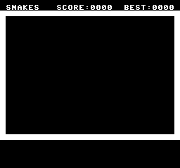
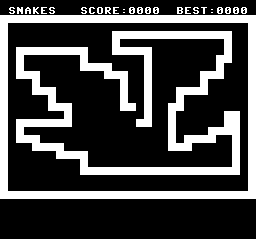

2 SNakES
---------

Continuing on from where we left off in Hello World, the next Classic is Snake. You know the one, where you move around a small area in 4 directions trying to eat something, and every time you do you get 1 longer.

I'm going to just use the tilemap and PETSCII again.

So what do we need for snake
- a playing field
- a score
- to be able to read the joypad
- be able to put things on the screen at an X/Y
- be able to read things on the screen at an X/Y
- a queue of some form to hold all the pieces of snake

First lets modify the Hello world to draw the play field. I'm going to go for a simple affair of top line for name, score and high score. Then a solid char border 1 char wide around the rest of the screen. While we are PAL and we could go for the larger screen view, I will make this NTSC sized for compatibility. Although putting things on the outmost edges is "illegal" and not compliant as most CRTs will clip off such areas either partially or fully and for a commercial title we would need to shrink the play area by 2 chars on either side at least. For this small, learn to code example that is going to be run in an emulator, it will do.

Now I want introduce the concept of Mirrors, this time rather than directly update the VRAM via the port directly as we did in Hello World, we are going to make a "clone" or mirror of the screen in WRAM that we update, then in the VBlank we DMA the entire screen to VRAM to update everything all at once. The benefit of this is we are free to make an many changes as we won't while the screen is drawing. Hardly an issue on this game as we could easily fit the entire update loop withing VBlank, even on the lowly NTSC machines, however this is a strong method that you will need to learn eventually so why not now.

Firstly, we need to define or "allocate" our Screen Mirror/Buffer. To do this at the top of the file we put
~~~
*=$0
; DP goes here

*=$100
; other variables go here

*=$200
ScreenMirror .fill $800

*=$8000
~~~
I'm going to put large buffers starting from $200, use $100 for normal variables and $0 for things that need to be in the DP. We need to allocate $800 bytes as a 32x32 screen is $$400 words. `.fill` tells 64tass to allocate the space but not to place anything at that location. Then we restore the PC to $8000 for the assembly of the code.
> Remember $$ for Word VRAM addresses/sizes and $ for Byte addresses/sizes
First we need to init this buffer as it is RAM, and it will be 0'd by our memory fill operation but we don't want 0 we want '{space}'. Again we will use DMA, but this time to the ScreenMirror and not VRAM.

So remove from `; fill the screen with ' '` down to, but not including the `NMI_ISR` lines and then add

~~~
; fill the screen with ' '
   ldx #$8008      ; A -> B, FIXED SOURCE, WRITE BYTE | WRAM
   stx $4300
   ldx #ScreenMirror
   stx $2181
   stz $2183       ; START AT 7E:ScreenMirror
   ldx #<>DMASpace ; this get the low word, you will need to change if not using 64tass
   stx $4302
   lda #`DMASpace  ; this gets the bank, you will need to change if not using 64tass
   sta $4304       ; and the upper byte will be 0
   ldx #$800       ; DMA counts bytes not words so we must give a byte size not a word size
   stx $4305       ; do $800/$$400
   lda #$01
   sta $420B       ; fire dma
~~~

now to put in the "walls", for this we will use... just kidding loops. To calculate the memory address of a given X/Y on the screen the formula is `BaseAddress+((Y*32)+X)*2` not the x2 since the mirror is in CPU's memory space we now address things as bytes and not words, also be careful **not** to multiply the base address by 2 as well.

Also a quick update about the PETSCII font conversion, I made a smaller error last time that was not really noticeable but it will be noticeable in this case. The PETSCII font has duplicates, duplicates that superfamiconv removed for us, we don't want this in this rare case so we have to convert it again using `superfamiconv -p petscii.pal -t petscii.chr -M snes -B 2 -W 8 -H 8 -R -F -D -i petscii.png`, I've added a `-D` option.

While we are speaking of the PETSCII open the png and have a look, you should notice that the bottom half is the upper half "reversed" to get the reversed version you add 128 or $80 to the char number. We want a solid char so that is Space + 128 to get the reversed space or "full block".

Thus to draw a line on the 2nd row and the last row, the 24 we simply do
~~~
; pre fill the Screen mirror with our arena
   ; first the outlines
   ; the top and bottom line
   rep #$20              ; A16
   lda #'{space}'+128    ; solid char
   ldx #62
-  sta ScreenMirror+(1*32*2),x
   sta ScreenMirror+(23*32*2),x
   dex
   dex
   bpl -
~~~

then the vertical lines, slightly harder as we have to offset down the screen, which means we can't just use a direct address but rather must use a pointer.
So we need to go back to the top of the file and add one, might as well add a couple, they tend to come in handy.
~~~
*=$0
; DP variables go here
DPPointer1 .long ?
DPPointer2 .long ?
~~~
then back down at our code
~~~
   ; the vertical lines
   lda #ScreenMirror+(2*32*2)
   sta DPPointer1
   ldx #20
-  lda #'{space}'+128  ; solid char
   ldy #0
   sta (DPPointer1),y
   ldy #31*2
   sta (DPPointer1),y
   clc
   lda DPPointer1
   adc #32*2
   sta DPPointer1
   dex
   bpl -
~~~
here I use the Y to form the effective "X" offset, allowing me to easy to both sides with a single pointer.

Then we want a base status bar, of which is just text so we basically do the same as we did for Hello World.
~~~
   ; the status row
   ldx #62
-  lda StatusRow,x
   sta ScreenMirror,x
   dex
   dex
   bpl -
   jsr DMAScreenToVRAM_ff
~~~
where `StatusRow` is defined as
~~~
.enc "screen"
                ;          1111111111122222222233
                ;01234567890123456789012345678901
StatusRow .word ' ','s','n','a','k','e','s',' ',' ',' ','s','c','o','r','e',':','0','0','0','0',' ',' ','b','e','s','t',':','0','0','0','0',' '
~~~
sadly 64Tass doesn't let us just do .word "string" so we have to do it character by character. There is a far better way to do this in 64tass, sadly it would be very hard to port to other assemblers, so I have gone with the simple yet verbose method.

> for those who are curious or don't want to type the above out, the 64tass way is
> ~~~
> StatusRow
> _data = ' snakes   score:0000  best:0000 '
> .for s in range(len(_data))
> .word _data[s]
> .next
> ~~~

this is great and everything however it is WRAM to see it we need it in VRAM, this something we will need to do every frame (we won't need to do it every frame, just we shall) and thus we shall make a sub routine.
> _sub routines_ are the assembly name, while a scoped higher level language such as C et al will call them _functions_. What is the difference? A function is fully encapsulated, in that it will take its parameters in and it will return an output based upon that input. It transforms the data given to it. A sub routine is a piece of code that we reuse as part of our main routine and is effectively part of it. I.E. in a sub routine, there are no params, everything is global and as such it will modify the global state as if it was part of the calling routine.

Sub routines are a matter of great care in 65816, there are many factors to influence how we construct them. Firstly, what size of A and X do they expect, what size of A and X will they return. As we get into more complicated 65816 we may also start to modify the direct page, and the data bank registers adding more complexity that has to be manually managed. Furthermore when you start using additional banks for code we will have the notion of local (to the bank) calling and far (across banks) calling, which need to have the correct return or else the stack will become corrupt and you will most likely crash.

Some people "cop out" on the size and just lock the 65816 into A8 and XY16, personally I feel this is a waste and makes juggling the already limited register set more complicated. A simple way of handling things is to let each sub routine handle the sizes it desires internally and it always restores the sizes to what was passed in. I sometimes do this and will do this in this example, for common routines that I don't want to think about and I feel they are called infrequently enough that the overhead is not a real concern. The other issue with it you can not return anything in the status flags with this method.

I'm going to propose and implement here a naming convention based system, and put the onus on the calling routine to make sure AXY are in the right format allowing for us to minimize the number of REPs and SEPs. For the expected size I'm going to use a suffix format of

- a for A 8bit
- A for A 16bit
- x for XY 8bit
- X for XY 16bit
- f for 'don't care'

While on the subject of naming conventions, if using Reluanch64 you may have noted that its auto complete is case-sensitive. While 64tass by default is case agnostic, you can make it case sensitive if you so desire. To this end, I will make routines camelCase (mostly) and then data PascalCase. This way when I want to call a routine, I can type the start of its name with a lower case then (Ctrl+Space) and the list will be filtered to routine names. Likewise when I want data I start with a Capital and get just data filtered.
The exception is I don't break Abbreviations, do we will have `DMAScreenToVRAM_ff` because `dmaScreenToVRAM_ff` or `dMAScreenToVRAM_ff` would be wrong ;)

However, this is just me, you do you, I present this as a _guide_.

Now on to making the routine, this is just a DMA routine that takes the `ScreenMirror` and puts it to \$$0000 in VRAM, the only trick here is that it is a `ff` routine so I do a php and a plp to store and restore the register sizes.
~~~
DMAScreenToVRAM_ff
   php
   rep #$10            ; XY16
   sep #$20            ; A8
   ldx #$1801          ; A -> B, copy source, write word | vram
   stx $4300
   ldx #<>ScreenMirror ; this get the low word, you will need to change if not using 64tass
   stx $4302
   lda #`ScreenMirror  ; this gets the bank, you will need to change if not using 64tass
   sta $4304           ; and the upper byte will be 0
   ldx #$800           ; DMA counts bytes not words so we must give a byte size not a word size
   stx $4305           ; do $$400 words
   lda #$80            ; inc on hi write
   sta $2115
   stz $2116
   stz $2117           ; start at $$0000
   lda #$01
   sta $420B           ; fire dma
   plp
   rts
~~~

which returning to main code above we shall now call, and then display the screen as we did in Hello World to verify, we have done what we think we have.

~~~
jsr DMAScreenToVRAM_ff
   sep #$20  ; A8
   ; set up screen addresses
   stz $2107 ; we want the screen at $$0000 and size 32x32
   lda #1
   sta $210B ; we want BG1 tile data to be $$1000 which is the first 4K word step
   stz $2105 ; 8x8 chars and Mode 0
   lda #1
   sta $212c ; BG1 is on the Main Screen
   lda #$ff
   sta $210e ; we also need to scroll up 1 pixel ( so do -1 )
   lda #$03
   sta $210e ; because the first line is not drawn
   lda #$0f
   sta $2100 ; don't blank, so show the screen at full brightness
-  jmp -     ; infinite loop we have nothing more to do
~~~

assemble and run the sfc as before, but if you are using my Mesen-S you will need to add additional commands as follows `64tass -a -x -X -b master.asm -o master.sfc --dump-label -l master.tass -L master.list --verbose-list` this will give you the tass file that will be auto loaded with asserts and breakpoints once we get to them.

You should be presented with  

The code to here is 

click to reveal code

~~~
*=$0
; DP variables go here
DPPointer1 .long ?
DPPointer2 .long ?

*=$100
; Normal variables go here

*=$200
ScreenMirror .fill $800

* = $8000
.as               ; Assume A8
.xs               ; Assume X8
.autsiz           ; Auto size detect
.databank $00     ; databank is 00
.dpage $0000      ; dpage is 0000
RESET
   clc
   xce ; enter 65816 mode
   rep #$30 ; AXY 16
   ldx #$1FFF
   txs      ; set the stack
   phk
   plb
   lda #0000
   tcd
   lda #$008f
   sta $2100 ; turn the screen off
   lda #$8008     ; A -> B, FIXED SOURCE, WRITE BYTE | WRAM
   sta $4300
   lda #<>DMAZero ; 64Tass | get low word
   sta $4302
   lda #`DMAZero  ; 64Tass | get bank
   sta $4304
   stz $2181
   stz $2182      ; START AT 7E:0000
   stz $4305      ; DO 64K
   lda #$0001
   sta $420B      ; FIRE DMA
   sta $420B      ; FIRE IT AGAIN, FOR NEXT 64k
   rep #$20       ; A16
   lda #$008F     ; FORCE BLANK, SET OBSEL TO 0
   sta $2100
   stz $2105 ;6
   stz $2107 ;8
   stz $2109 ;A
   stz $210B ;C
   stz $210D ;E
   stz $210D ;E
   stz $210F ;10
   stz $210F ;10
   stz $2111 ;12
   stz $2111 ;12
   stz $2113 ;14
   stz $2113 ;14
   stz $2119 ;1A to get Mode7
   stz $211B ;1C these are write twice
   stz $211B ;1C regs
   stz $211D ;1E
   stz $211D ;1E
   stz $211F ;20
   stz $211F ;20
   stz $2123 ;24
   stz $2125 ;26
   stz $2126 ;27 YES IT DOUBLES OH WELL
   stz $2128 ;29
   stz $212A ;2B
   stz $212C ;2D
   stz $212E ;2F
   stz $2130 ;31
   lda #$00E0
   sta $2132
   ;ONTO THE CPU I/O REGS
   lda #$FF00
   sta $4200
   stz $4202 ;3
   stz $4204 ;5
   stz $4206 ;7
   stz $4208 ;9
   stz $420A ;B
   stz $420C ;D
   ; CLEAR VRAM
   rep #$20        ; A16
   lda #$1809      ; A -> B, fixed source, write word | vram
   sta $4300
   lda #<>DMAZero  ; this get the low word, you will need to change if not using 64tass
   sta $4302
   lda #`DMAZero   ; this gets the bank, you will need to change if not using 64tass
   sta $4304       ; and the upper byte will be 0
   stz $4305       ; do 64k
   lda #$80        ; inc on hi write
   sta $2115
   stz $2116       ; start at $$0000
   lda #$01
   sta $420B       ; fire dma
   ; CLEAR CG-RAM
   lda #$2208      ; a -> b, fixed source, write byte | cg-ram
   sta $4300
   lda #$200       ; 512 bytes
   sta $4305
   sep #$20        ; A8
   stz $2121       ; start at 0
   lda #$01
   sta $420B       ; fire dma
   ; DMA Petscii Font
   rep #$30        ; AXY 16
   lda #<>PETSCII_Chars
   sta $4302
   sep #$20        ; A8
   lda #`PETSCII_Chars
   sta $4304
   ldx #size(PETSCII_Chars)
   stx $4305
   ldx #%00000001 | $1800   ; A->B, Inc, Write WORD, $2118
   stx $4300
   ldx #$1000
   stx $2116
   lda #$80
   sta $2115                ; inc VRAM port address
   lda #1
   sta $420B
   ; DMA Pallete
   ldx #<>PETSCII_Pal
   stx $4302
   lda #`PETSCII_Pal
   sta $4304
   ldx #8
   stx $4305
   ldx #%00000010 | $2200  ; A->B, Inc, Write 2 Bytes, $2122
   stx $4300
   stz $2121               ; start of Pallete
   lda #1
   sta $420B
   ; fill the screen with ' '
   ldx #$8008      ; A -> B, FIXED SOURCE, WRITE BYTE | WRAM
   stx $4300
   ldx #ScreenMirror
   stx $2181
   stz $2183       ; START AT 7E:ScreenMirror
   ldx #<>DMASpace ; this get the low word, you will need to change if not using 64tass
   stx $4302
   lda #`DMASpace  ; this gets the bank, you will need to change if not using 64tass
   sta $4304       ; and the upper byte will be 0
   ldx #$800       ; DMA counts bytes not words so we must give a byte size not a word size
   stx $4305       ; do 64k
   lda #$01
   sta $420B       ; fire dma
   ; pre fill the Screen mirror with our arena
   ; first the outlines
   ; the top and bottom line
   rep #$20              ; A16
   lda #'{space}'+128    ; solid char
   ldx #62
-  sta ScreenMirror+(1*32*2),x
   sta ScreenMirror+(23*32*2),x
   dex
   dex
   bpl -
   ; the vertical lines
   lda #ScreenMirror+(2*32*2)
   sta DPPointer1
   ldx #20
-  lda #'{space}'+128  ; solid char
   ldy #0
   sta (DPPointer1),y
   ldy #31*2
   sta (DPPointer1),y
   clc
   lda DPPointer1
   adc #32*2
   sta DPPointer1
   dex
   bpl -
   ; the status row
   ldx #62
-  lda StatusRow,x
   sta ScreenMirror,x
   dex
   dex
   bpl -
   jsr DMAScreenToVRAM_ff
   sep #$20  ; A8
   ; set up screen addresses
   stz $2107 ; we want the screen at $$0000 and size 32x32
   lda #1
   sta $210B ; we want BG1 tile data to be $$1000 which is the first 4K word step
   stz $2105 ; 8x8 chars and Mode 0
   lda #1
   sta $212c ; BG1 is on the Main Screen
   lda #$ff
   sta $210e ; we also need to scroll up 1 pixel ( so do -1 )
   lda #$03
   sta $210e ; because the first line is not drawn
   lda #$0f
   sta $2100 ; don't blank, so show the screen at full brightness
-  jmp -     ; infinite loop we have nothing more to do

.enc "screen"
                ;          1111111111122222222233
                ;01234567890123456789012345678901
StatusRow .word ' ','s','n','a','k','e','s',' ',' ',' ','s','c','o','r','e',':','0','0','0','0',' ',' ','b','e','s','t',':','0','0','0','0',' '

DMAScreenToVRAM_ff
   php
   rep #$10            ; XY16
   sep #$20            ; A8
   ldx #$1801          ; A -> B, copy source, write word | vram
   stx $4300
   ldx #<>ScreenMirror ; this get the low word, you will need to change if not using 64tass
   stx $4302
   lda #`ScreenMirror  ; this gets the bank, you will need to change if not using 64tass
   sta $4304           ; and the upper byte will be 0
   ldx #$800           ; DMA counts bytes not words so we must give a byte size not a word size
   stx $4305           ; do $$400 words
   lda #$80            ; inc on hi write
   sta $2115
   stz $2116
   stz $2117           ; start at $$0000
   lda #$01
   sta $420B           ; fire dma
   plp
   rts

NMI_ISR
   ; nothing needed yet
justRTI
   rti

.enc "screen" ; tell 64Tass we want the text to be written in C64 Screen codes encoding
DMASpace .word ' '

PETSCII_Chars .binary "petscii.chr"

PETSCII_Pal .binary "petscii.pal"

* = $ffb0
    .enc "none"
DMAZero
    .fill 16,0
    ;               111111111112
    ;      123456789012345678901
    .text "this is a dummy name "
.cerror * != $00ffd5, "name is too short", *
    .byte $20   ; Mapping
    .byte $00   ; Rom
    .byte $07   ; 128K
    .byte $00   ; 0 SRAM
    .byte $02   ; PAL
    .byte $33   ; Version 3
    .byte $00   ; rom version 0
    .word $FFFF ; complement
    .word $0000 ; CRC

; 65816 vectors
* = $ffe4
v16_COP    .word justRTI
v16_BRK    .word justRTI
v16_ABORT  .word justRTI
v16_NMI    .word NMI_ISR
v16_RESET  .word justRTI
v16_IRQ    .word justRTI

; 6502 vectors
* = $fff4
v02_COP    .word justRTI
v02_BRK    .word justRTI
v02_ABORT  .word justRTI
v02_NMI    .word justRTI
v02_RESET  .word RESET
v02_IRQ    .word justRTI
~~~

Our stage is set, time to add some Actors. The Snake. To make the snake we need to know :

- where the head is
- where the tail is
- which way we are heading
- how fast we are moving

To this end let’s declare some variables for us to use. Near the top of the file under the `*=$100` section add the following variables
~~~
HeadX .byte ?
HeadY .byte ?
TailX .byte ?
TailY .byte ?
CurrentHeading .byte ?
SpeedCounter .byte ?
SpeedValue .byte ?
~~~

First step is to get the snake drawing, so I will make a routine that sets the char at HeadX/Y to be solid.

~~~
.al
.xs              ; tell the assembler this routine expects A16,XY8
drawHeadToScreen_Ax
_ASSERT_a16
_ASSERT_xy8
   lda HeadY
   and #$00ff
   asl a        ;2x
   asl a        ;4x
   asl a        ;8x
   asl a        ;16x
   asl a        ;32x
   asl a        ;64x
   clc
   adc #ScreenMirror
   sta DPPointer1
   lda HeadX
   asl a
   tay
   lda #'{space}'+128
   sta (DPPointer1),y
   rts
~~~
I wrote the routine first, then added the _Ax designation, this way I was able to choose the optimal format for this routine.

A is 16 bits, but HeadY is a byte, rather than doing a
~~~
sep #$20 ; A8
lda HeadY
rep #$20 ; A16
~~~
I read the upper 8bits and then "and them away", this is both faster, smaller and safer. Can you see how it could fail in the sep/rep case?

Expand for solution

A unlike X and Y does not clear the upper 8bits when you change size, but rather preserves it, so let’s imagine that A contains $1234 at the entry to the code, and that HeadY is $78, what do we get when the above code is run?

~~~
......          A = $1234
sep #$20        A = $1234
lda HeadY       A = $xx78
rep #$20        A = $1278
~~~

not what you hoped, I'm sure.

We know from before that the formula for a Screen position given an X and Y is `Base+(Y*64)+(X*2)` fortunately these are power of 2 multiplications that can be done with shifts. So the code above effectively does Y*64+Base+(X*2). You could avoid the need to a DP address if you combined the X*2 and Y*64. However HeadX being 8bits causes pain in this case, there is no nice simple way to just get the 8bits and add it to the 16bit value. In this specific case one could do

~~~
.al
.xs              ; tell the assembler this routine expects A16,XY8
drawHeadToScreen_Ax
_ASSERT_a16
_ASSERT_xy8
   lda HeadY
   and #$00ff
   asl a        ;2x
   asl a        ;4x
   asl a        ;8x
   asl a        ;16x
   asl a        ;32x
   sep #$10     ;A8
   ora HeadX
   rep #$10     ;A16
   asl a        ;64x
   tay
   lda #'{space}'+128
   sta ScreenMirror,y
   rts
~~~

As long as HeadX is below 32 this will work, but will go odd in weird ways should you accidentally go over. This effectively does Base+(y*32+x)*2 because with a power of 2 value an ora is the same as an add.

Another important aspect is the `.al` and `.xs` you should do this before **every** sub routine, don't just assume it is fine as it is the same as the routine above. You may add new code to the above routine, which changes the sizes, you might add a new routine between, also the assembler is not omnipresent it won't understand php and plp setting and restorations of the sizes. Thus in order to avoid errors due to "assembled at the wrong size" _always specify the sizes you expect above a routine_ unless as per the DMA routine above it is a 'ff' case to which you will explicitly set or not be bothered in the routine.

the `_ASSERT_a16` and `_ASSERT_xy8` are only useful if you are using 64tass and my version of Mesen-S. Upon opening the debugger (you have to have it open for asserts to register), it will add asserts to the code automatically that will fire if you jump/jsr to the routine with the wrong sized A or XY, allowing you to quickly detect that the code has "gone wrong".

Great, lets test it out and make sure it works. Firstly, init the Head and we might as well do the Tail while we are at it, to the middle of the _stage_, then draw it to the screen buffer, then DMA the screen buffer to VRAM.
~~~
   lda #16
   sta HeadX
   sta TailX
   lda #12
   sta HeadY
   sta TailY
   rep #$20 ; A16
   sep #$10 ; XY8
   jsr drawHeadToScreen_Ax
   jsr DMAScreenToVRAM_ff
-  jmp -
~~~

And assemble and run the SFC and you should be greeted with the same as before only now there is a large white dot in the middle.

## Movement

We need to make it move, and ideally make it move based upon the last joypad input. Once the snake starts it doesn't stop, well until it hits something.

To do this we need to do six things :

- init the `CurrentHeading` variable to 0 for no movement
- decided on what numbers mean what directions
- scan the Gamepad
- update the `CurrentHeading` variable based upon the Gamepad
- move the head based upon the `CurrentHeading`
- slow it down

The first step is easy, just add a `stz CurrentHeading` where we init the Head and Tail. As A is 8bits at that point already.

The second step really depends on how much you agonize over things. But I'm just going to go with degree order, although you could go compass order if you like. To help with this I'm going to make some `defines` to make the code more readable.
~~~
kHead .block
   none = 0
   right = 1
   up = 2
   left = 3
   down = 4
.bend
~~~

> `.block` is a 64tass directive that lets us declare scopes, similar to an enum in C. In this instance to specify `none` we would use `kHead.none`. I prefix constants with a k because decades of using Hungarian Notion and C was used for "Class" so k for Constant. It also helps with auto complete, and Reluanch64 fully understands blocks and scopes so you will get full auto complete support in it.

For scanning the Gamepad, the SNES has a lovely build in auto scan feature that we can request. No more manual shifting and clocking. However, there is a trap.

It takes time for the controllers to be `clocked` in, and if you read the auto registers too soon, you will get inconsistent and invalid results. The process starts as soon as VBlank begins and takes a few lines to complete, the controllers are "slow" and the system attempts to read all 4 controllers. Typically, one DMA's OAM at the start of VBlank, this nicely covers the scan period, but we don't use sprites yet. Rather we will DMA the screen instead which is larger and hence serves the purpose just as well.

To ease readability, I will again define some constants
~~~
kJoypad .block
   BtnR      = 16
   BtnL      = 32
   BtnX      = 64
   BtnA      = 128
   DirRight  = 256
   DirLeft   = 512
   DirDown   = 1024
   DirUp     = 2048
   BtnStart  = 4096
   BtnSelect = 8192
   BtnY      = 16384
   BtnB      = 32768
.bend
~~~

Before we get to dealing with the gamepad input, we first need to set up the NMI and the Main Game loops. These form 2 threads, the System will give us an NMI every frame, when we tell it to, this will cause the CPU to stop what it was doing and jump to the vector at $ffea/b which have called NMI_ISR (Interrupt Service Routine). In this we must preserve all registers and completely all registers i.e all 16bits of them. We should also preserve the data bank for "future proofing", one should also preserve and reset the DP to a known value but that will be quite some time away. We will then update the Screen in VRAM with the mirror and then set a `flag` to notify that the "frame has begun" and that it is free to do its work when it gets a chance. It will then restore the state before the interruption occurred and then exit the handler.

Update your placeholder `NMI_ISR` with
~~~
NMI_ISR
   rep #$30 ; AXY16
   pha
   phx
   phy
   phb
   phk
   plb
   jsr DMAScreenToVRAM_ff
   sep #$20 ; A8
   lda #$ff
   sta NMIDoneNF
   rep #$20 ; A16
   plb
   ply
   plx
   pla
justRTI
   rti
~~~

We also need to define a `NMIDoneNF` variable, so go and add it under the `$100` section.

> Another naming convention thing. I use 'NF', 'PF', 'NZ', 'IZ' at the end of my flags to remind me how to set/clear the flag. In this case NF means Negative Flag, i.e it is set to a negative value when it is "set", PF,NZ,IZ are Positive Flag,Not Zero and Is Zero respectively. It helps me remember how to set and clear it and know if I'm setting or clearing it when I read my code.

At the bottom of the "main code" append
~~~
mainLoop
   sep #$20      ; A8
   stz NMIDoneNF ; clear any pending NMI
-  lda NMIDoneNF ; wait for the next one
   bpl -
   ; NMI is finished so we can update
~~~

This will now wait for the NMI to fire and then we can "update our frame", then jump back to `mainloop` when we are ready.

Of cause we have to actually enable VBlank NMIs before this will happen. Yes Nintendo made it so you can Mask the Non-Maskable ;)

To do this, somewhere before the `mainloop` where A is 8bits and after we have set machine up, so just before we init the game state for example, add
~~~
   lda #%10000001 ; enable NMI VBlanks and Gamepad scanning
   sta $4200
~~~

> numbers are decimal, $ means hexadecimal, % means binary. This is fairly common through out all the assemblers. For specifying registers that have "bit flags" it can be convenient to use the binary notation. Side note 64tass doesn't support octal numbers which traditionally are prefixed with a leading 0 i.e 081 is an octal number. 64tass will warn you about leading 0s and that it will not form an octal number if that is what you were expecting.

This is also the register where we tell the SNES we want it to scan the gamepads for us.

Now to read the gamepad and update based upon it. After the `mainLoop` code add
~~~
; NMI is finished so we can update
   sep #$10 ; XY8
   ; update the heading direction
   lda $4218+1
   bit #>kJoypad.DirUp
   beq _notUp
      ldx #kHead.up
      bne _setNew
_notUp
   bit #>kJoypad.DirDown
   beq _notDown
      ldx #kHead.down
      bne _setNew
_notDown
   bit #>kJoypad.DirLeft
   beq _notLeft
      ldx #kHead.left
      bne _setNew
_notLeft
   bit #>kJoypad.DirRight
   beq _noMoveChange
      ldx #kHead.right
_setNew
   stx CurrentHeading
_noMoveChange
~~~

the D-Pad is located in the upper 8bits of the gamepad byte, so rather than switch to 16bits and then waste the lower byte, I just read the upper byte (+1) and then use `>` to get the upper byte of the constant value. If you forget the `>` you will get a warning about it being too big. The SNES inverts the controllers signals and hence now unlike almost everything else I can think of, the results are "Active High", I.E if the bit is 1 the button is pressed.

The code is fairly straight forward, I test each bit and then if it pressed then I set X to the matching direction encoding and then jump to store it. If none are set then we will end up at `_noMoveChange`

From here based upon the direction we update the position. This is easily done using a Look Up Table (LUT) this way we can just offset the X and Y based upon it, then set the new position and loop.

~~~
   ldx CurrentHeading
   clc
   lda XDelta,x
   adc HeadX
   sta HeadX
   clc
   lda YDelta,x
   adc HeadY
   sta HeadY
~~~
where further down the file we define
~~~
XDelta .char  0, 1, 0,-1, 0
YDelta .char  0, 0,-1, 0, 1
~~~
> note in 64tass `.byte` is unsigned and `.char` is signed. if you try to do -1 with a `.byte` you will get an error saying it is not in range 0,255
To go to the right we add 1,  to go to the left we _add_ -1 and likewise for the Y. The first entry is 0,0 for the `none` case.

Then we need to put it on the Screen via the mirror, then wait for the next frame.
~~~
   rep #$20                     ; A16
   sep #$10                     ; X8
   jsr drawHeadToScreen_Ax
   jmp mainLoop
~~~

This will be too fast at the moment, as once you start to move you will move per frame and that will be at a rate of almost 2 screens worth a second! So let’s slow down the update.

To achieve this, we use a simple counter that only does a movement when it reaches a negative value, then it resets its value.

First define some new variables to hold these values
~~~
SpeedCounter .byte ?
SpeedValue   .byte ?
~~~

Then after `_noMoveChange` add the follow code
~~~
   dec SpeedValue
   bpl MainLoop

   lda SpeedCounter
   sta SpeedValue
~~~

we will need to init these to something sensible first, so in the area of code where we init the game state add
~~~
   stz SpeedCounter
   lda #10
   sta SpeedValue
~~~

Now assemble and run, and with any luck you will be able to move the dpad and start to draw around the screen, making a picture akin to the Apple // lo-res mode.

Your current code should look similar to this

click to reveal code

BANK80.asm

~~~~

kJoypad .block
   BtnR      = 16
   BtnL      = 32
   BtnX      = 64
   BtnA      = 128
   DirRight  = 256
   DirLeft   = 512
   DirDown   = 1024
   DirUp     = 2048
   BtnStart  = 4096
   BtnSelect = 8192
   BtnY      = 16384
   BtnB      = 32768
.bend

kHead .block
   none = 0
   right = 1
   up = 2
   left = 3
   down = 4
.bend

*=$0
; DP variables go here
DPPointer1 .long ?
DPPointer2 .long ?

*=$100
; Normal variables go here
HeadX .byte ?
HeadY .byte ?
TailX .byte ?
TailY .byte ?
TargetX .byte ?
TargetY .byte ?
CurrentHeading .byte ?
SpeedCounter .byte ?
SpeedValue .byte ?
NMIDoneNF .byte ?

*=$200
ScreenMirror .fill $800

* = $8000
.as               ; Assume A8
.xs               ; Assume X8
.autsiz           ; Auto size detect
.databank $00     ; databank is 00
.dpage $0000      ; dpage is 0000
RESET
   clc
   xce ; enter 65816 mode
   rep #$30 ; AXY 16
   ldx #$1FFF
   txs      ; set the stack
   phk
   plb
   lda #0000
   tcd
   lda #$008f
   sta $2100 ; turn the screen off
   lda #$8008     ; A -> B, FIXED SOURCE, WRITE BYTE | WRAM
   sta $4300
   lda #<>DMAZero ; 64Tass | get low word
   sta $4302
   lda #`DMAZero  ; 64Tass | get bank
   sta $4304
   stz $2181
   stz $2182      ; START AT 7E:0000
   stz $4305      ; DO 64K
   lda #$0001
   sta $420B      ; FIRE DMA
   sta $420B      ; FIRE IT AGAIN, FOR NEXT 64k
   rep #$20    ; A16
   lda #$008F  ; FORCE BLANK, SET OBSEL TO 0
   sta $2100
   stz $2105 ;6
   stz $2107 ;8
   stz $2109 ;A
   stz $210B ;C
   stz $210D ;E
   stz $210D ;E
   stz $210F ;10
   stz $210F ;10
   stz $2111 ;12
   stz $2111 ;12
   stz $2113 ;14
   stz $2113 ;14
   stz $2119 ;1A to get Mode7
   stz $211B ;1C these are write twice
   stz $211B ;1C regs
   stz $211D ;1E
   stz $211D ;1E
   stz $211F ;20
   stz $211F ;20
   stz $2123 ;24
   stz $2125 ;26
   stz $2126 ;27 YES IT DOUBLES OH WELL
   stz $2128 ;29
   stz $212A ;2B
   stz $212C ;2D
   stz $212E ;2F
   stz $2130 ;31
   lda #$00E0
   sta $2132
   ;ONTO THE CPU I/O REGS
   lda #$FF00
   sta $4200
   stz $4202 ;3
   stz $4204 ;5
   stz $4206 ;7
   stz $4208 ;9
   stz $420A ;B
   stz $420C ;D
   ; CLEAR VRAM
   rep #$20        ; A16
   lda #$1809      ; A -> B, fixed source, write word | vram
   sta $4300
   lda #<>DMAZero  ; this get the low word, you will need to change if not using 64tass
   sta $4302
   lda #`DMAZero   ; this gets the bank, you will need to change if not using 64tass
   sta $4304       ; and the upper byte will be 0
   stz $4305       ; do 64k
   lda #$80        ; inc on hi write
   sta $2115
   stz $2116       ; start at $$0000
   lda #$01
   sta $420B       ; fire dma
   ; CLEAR CG-RAM
   lda #$2208      ; a -> b, fixed source, write byte | cg-ram
   sta $4300
   lda #$200       ; 512 bytes
   sta $4305
   sep #$20        ; A8
   stz $2121       ; start at 0
   lda #$01
   sta $420B       ; fire dma
   ; DMA Petscii Font
   rep #$30        ; AXY 16
   lda #<>PETSCII_Chars
   sta $4302
   sep #$20        ; A8
   lda #`PETSCII_Chars
   sta $4304
   ldx #size(PETSCII_Chars)
   stx $4305
   ldx #%00000001 | $1800   ; A->B, Inc, Write WORD, $2118
   stx $4300
   ldx #$1000
   stx $2116
   lda #$80
   sta $2115                ; inc VRAM port address
   lda #1
   sta $420B
   ; DMA Pallete
   ldx #<>PETSCII_Pal
   stx $4302
   lda #`PETSCII_Pal
   sta $4304
   ldx #8
   stx $4305
   ldx #%00000010 | $2200  ; A->B, Inc, Write 2 Bytes, $2122
   stx $4300
   stz $2121               ; start of Pallete
   lda #1
   sta $420B
   ; fill the screen with ' '
   ldx #$8008     ; A -> B, FIXED SOURCE, WRITE BYTE | WRAM
   stx $4300
   ldx #ScreenMirror
   stx $2181
   stz $2183      ; START AT 7E:ScreenMirror
   ldx #<>DMASpace ; this get the low word, you will need to change if not using 64tass
   stx $4302
   lda #`DMASpace  ; this gets the bank, you will need to change if not using 64tass
   sta $4304       ; and the upper byte will be 0
   ldx #$800       ; DMA counts bytes not words so we must give a byte size not a word size
   stx $4305       ; do $$400 words
   lda #$01
   sta $420B       ; fire dma
   ; pre fill the Screen mirror with our arena
   ; first the outlines
   ; the top and bottom line
   .enc "screen"
   rep #$20              ; A16
   lda #'{space}'+128  ; solid char
   ldx #62
-  sta ScreenMirror+(1*32*2),x
   sta ScreenMirror+(23*32*2),x
   dex
   dex
   bpl -
   ; the vertical lines
   lda #ScreenMirror+(2*32*2)
   sta DPPointer1
   ldx #20
-  lda #'{space}'+128  ; solid char
   ldy #0
   sta (DPPointer1),y
   ldy #31*2
   sta (DPPointer1),y
   clc
   lda DPPointer1
   adc #32*2
   sta DPPointer1
   dex
   bpl -
   ; the status row
   ldx #62
-  lda StatusRow,x
   sta ScreenMirror,x
   dex
   dex
   bpl -
   jsr DMAScreenToVRAM_xx
   sep #$20  ; A8
   ; set up screen addresses
   stz $2107 ; we want the screen at $$0000 and size 32x32
   lda #1
   sta $210B ; we want BG1 tile data to be $$1000 which is the first 4K word step
   stz $2105 ; 8x8 chars and Mode 0
   lda #1
   sta $212c ; BG1 is on the Main Screen
   lda #$ff
   sta $210e ; we also need to scroll up 1 pixel ( so do -1 )
   lda #$03
   sta $210e ; because the first line is not drawn
   lda #$0f
   sta $2100 ; don't blank, so show the screen at full brightness
   ; enable NMI to get us a game loop
   lda #%10000001  ; enable NMI VBlanks and Gamepad scanning
   sta $4200
   lda #10
   sta SpeedCounter
   stz SpeedValue
   lda #16
   sta HeadX
   sta TailX
   lda #12
   sta HeadY
   sta TailY
   rep #$20 ; A16
   sep #$10 ; XY8
   jsr drawHeadToScreen_Ax
mainLoop
   sep #$20 ; A8
   stz NMIDoneNF
-  lda NMIDoneNF
   bpl -
   ; NMI is finished so we can update
   sep #$10 ; XY8
   ; update the heading direction
   lda $4218+1
   bit #>kJoypad.DirUp
   beq _notUp
      ldx #kHead.up
      bne _setNew
_notUp
   bit #>kJoypad.DirDown
   beq _notDown
      ldx #kHead.down
      bne _setNew
_notDown
   bit #>kJoypad.DirLeft
   beq _notLeft
      ldx #kHead.left
      bne _setNew
_notLeft
   bit #>kJoypad.DirRight
   beq _noMoveChange
      ldx #kHead.right
_setNew
   stx CurrentHeading
_noMoveChange
   dec SpeedValue
   bpl MainLoop

   lda SpeedCounter
   sta SpeedValue
   ldx CurrentHeading
   clc
   lda XDelta,x
   adc HeadX
   sta HeadX
   clc
   lda YDelta,x
   adc HeadY
   sta HeadY
   rep #$20
   jsr drawHeadToScreen_Ax
   jmp mainLoop

XDelta .char  0, 1, 0,-1, 0
YDelta .char  0, 0,-1, 0, 1

.enc "screen"
                ;          1111111111122222222233
                ;01234567890123456789012345678901
StatusRow .word ' ','s','n','a','k','e','s',' ',' ',' ','s','c','o','r','e',':','0','0','0','0',' ',' ','b','e','s','t',':','0','0','0','0',' '

DMAScreenToVRAM_xx
   php
   rep #$10            ; XY16
   sep #$20            ; A8
   ldx #$1801          ; A -> B, copy source, write word | vram
   stx $4300
   ldx #<>ScreenMirror ; this get the low word, you will need to change if not using 64tass
   stx $4302
   lda #`ScreenMirror  ; this gets the bank, you will need to change if not using 64tass
   sta $4304           ; and the upper byte will be 0
   ldx #$800           ; DMA counts bytes not words so we must give a byte size not a word size
   stx $4305           ; do $$400 words
   lda #$80            ; inc on hi write
   sta $2115
   stz $2116
   stz $2117           ; start at $$0000
   lda #$01
   sta $420B           ; fire dma
   plp
   rts

.al
.xs              ; tell the assembler this routine expects A16,XY8
drawHeadToScreen_Ax
_ASSERT_a16
_ASSERT_xy8
   lda HeadY
   and #$00ff
   asl a        ;2x
   asl a        ;4x
   asl a        ;8x
   asl a        ;16x
   asl a        ;32x
   asl a        ;64x
   clc
   adc #ScreenMirror
   sta DPPointer1
   lda HeadX
   asl a
   tay
.enc "none" ; we need to this to be 160,
            ; to which we need the none encoding
            ; not the screen oddly enough
   lda #'{space}'+128
   sta (DPPointer1),y
   rts

NMI_ISR
   rep #$30 ; AXY16
   pha
   phx
   phy
   phb
   phk
   plb
   jsr DMAScreenToVRAM_xx
   sep #$20 ; A8
   lda #$ff
   sta NMIDoneNF
   rep #$20 ; A16
   plb
   ply
   plx
   pla
justRTI
   rti

.enc "screen" ; tell 64Tass we want the text to be written in C64 Screen codes encoding
DMASpace .word ' '

PETSCII_Chars .binary "petscii.chr"

PETSCII_Pal .binary "petscii.pal"

* = $ffb0
    .enc "none"
DMAZero
    .fill 16,0
    ;               111111111112
    ;      123456789012345678901
    .text "this is a dummy name "
.cerror * != $00ffd5, "name is too short", *
    .byte $20   ; Mapping
    .byte $00   ; Rom
    .byte $07   ; 128K
    .byte $00   ; 0 SRAM
    .byte $02   ; PAL
    .byte $33   ; Version 3
    .byte $00   ; rom version 0
    .word $FFFF ; complement
    .word $0000 ; CRC

; 65816 vectors
* = $ffe4
v16_COP    .word justRTI
v16_BRK    .word justRTI
v16_ABORT  .word justRTI
v16_NMI    .word NMI_ISR
v16_RESET  .word justRTI
v16_IRQ    .word justRTI

; 6502 vectors
* = $fff4
v02_COP    .word justRTI
v02_BRK    .word justRTI
v02_ABORT  .word justRTI
v02_NMI    .word justRTI
v02_RESET  .word RESET
v02_IRQ    .word justRTI

~~~~

or something like it

And you can make something like this

We're not here to make an Apple // drawing program however, the previous position should be cleared as we move, however we also need to know all the places in between where we are and the end of where we have been so as we grow we can only remove the last square.

We could just clear the head, then update the head, then draw it again and that would seem to do "the thing" but that is just a stop gap solution.

We want the snake to grow, and to grow we need to keep track of every point it is at, and where it has been, for however many points the length the snake currently is.

To do this we will use a _Circular buffer_. A Circular buffer is an array that then when you get to the end of the buffer, you loop back around to first entry again. Hence it forms a circle as it moves around. Making this a power of 2 makes it trivial, but not power of two is only marginally harder. I.E the next "array index" is given by
~~~
   clc
   adc #1
   and #len-1
~~~
while if you are not power of 2 it becomes
~~~
   clc
   adc #1
   cmp #len
   bne +
      lda #0
+
~~~

The next trick is we have an X and Y to store which would take 2 bytes, but we don't need a raw X and Y we just need to know how to move to next point, I.E we store the _CurrentHeading_ rather than a raw X and Y. The HeadX and Y and the TailX and Y give us the absolute points, and this queue tells us how tail gets to head, what directions it undertakes. To do this we match the tail and head to an index in our _Circular buffer_, a _HeadIndex_ and a _TailIndex_.

There are two standards. The Indexes point to the current active or to the one after the current active AKA next. I.E to add to it we either

store  
inc

or

inc  
store

then when we read we do

read 
inc

or

inc  
read

I'm going to go with the inc store/read standard.

How big do we make our buffer?

We have a 32x28 screen of which we take in 2 for the 1 wall on both sides on the X and then 2 for the walls on the Y and 1 more for the HUD thus we have a 30x25 _stage_ of which the absolute maximum length the snake can be is 750, nobody will ever get it but oh well, to which the next power of two size is 1024 and I have 128K so 1024 it is.

To make this _Circular Buffer_ we will need to make some new variables. In the Normal variables area so $100 add
~~~
HeadIndex .word ?
TailIndex .word ?
~~~

since we need to hold up to 1024 elements, they need to be Word size. Then in the Large variable area so the $200 declare our Array/Buffer like so

~~~
SnakeArray .fill $400
~~~

now a few simple utility routines that lets us interact with the _Circular Buffer_
~~~
.al
.xl
pushCurrentToQueue_AX
_ASSERT_a16
_ASSERT_xy16
   clc
   lda HeadIndex
   adc #1         ; add 1
   and #1024-1     ; wrap around size
   sta HeadIndex
   tax
   sep #$20        ; A8
   lda CurrentHeading
   sta SnakeArray,x
   rep #$20        ; A16
   rts

.al
.xl
updateTailFromQueue_AX
_ASSERT_a16
_ASSERT_xy16
   ; update tail
   clc
   lda TailIndex
   adc #1          ; add 1
   and #1024-1      ; wrap around size
   sta TailIndex
   tax
   lda SnakeArray,x
   and #$ff       ; don't set A to 8bit or you will get a 16 bit value into X
   tax
   sep #$20         ; A8
   clc
   lda XDelta,x
   adc TailX
   sta TailX
   clc
   lda YDelta,x
   adc TailY
   sta TailY
   rep #$20         ; A16
   rts
~~~

The first one, simply increments the _HeadIndex_ with wrap around thanks to the 'and' and then stores the Current Heading to it.

The second one, is actually two routines in one. Rather than get the value and then update the Tails X and Y with another routine I found it simpler and neater to do it "on the spot" as I have no other use for the value contained within the queue.

It increments the _TailIndex_ with wrap around, then reads the value and uses the X and Y delta LUTs we made earlier to offset the Tail X and Y and returns.

There is a little trap in this routine though which I wish to highlight.
~~~
   tax
   lda SnakeArray,x
   and #$ff       ; don't set A to 8bit or you will get a 16 bit value into X
   tax
   sep #$20      ; A8
   clc
~~~
You may ponder why do and #$ff if I'm going to A8 anyway, why not just
~~~
   tax
   sep #$20      ; A8
   lda SnakeArray,x
   tax
   clc
~~~
because that will work most of the time, but will go wrong every now and then. Can you see it? Think hard. A clue, X is 16bits at the start of this segment.

click to reveal solution

The destination sets the size of the transfer.  
A does not clear the upper 8 bits when you switch sizes as B is preserved.  
so if A is $10XX  
Then `SnakeArray,x` with 8 bits and let’s say that it hold $23 for example now A is $1023. 
Normally this would be fine as A is in 8bit mode and hence the $10 will not factor into to any operation. However, we are transferring to X which is 16bits, dest sets size and so the `tax` will set X to $1023 not $0023 giving you a random hard to track down bug.  
Be vigilant!

One more utility routine is needed, one to _clear_ the tail. This is basically like the _drawHead_ routine, only its reads from the tail and writes " " to the screen. So below the head routine add
~~~
.al
.xs              ; tell the assembler this routine expects A16,XY8
clearTailOnScreen_Ax
_ASSERT_a16
_ASSERT_xy8
   lda TailY
   and #$00ff
   asl a        ;2x
   asl a        ;4x
   asl a        ;8x
   asl a        ;16x
   asl a        ;32x
   asl a        ;64x
   clc
   adc #ScreenMirror
   sta DPPointer1
   lda TailX
   asl a
   tay
   lda #'{space}'
   sta (DPPointer1),y
   rts
~~~

So now the main loop needs to be

- update head pos for current direction
- update Tail from queue
- clear the tail pos on the screen
- draw head pos on the screen
- push the current direction to the queue

which is simply

~~~
   rep #$30                      ; AXY16
   jsr updateTailFromQueue_AX
   sep #$10                      ; XY8
   jsr clearTailOnScreen_Ax
   rep #$20                        ; A16
   sep #$10                        ; X8
   jsr drawHeadToScreen_Ax
   rep #$30                        ; AXY16
   jsr pushCurrentToQueue_AX
   sep #$20                      ; A8
   jmp mainLoop
~~~

Oh and don't forget to add some code that will clear the Index's to zero so they don't just point to nowhere.
I found a point where A is 16bits, remember they are words, and added a stz as follows
~~~
   rep #$20 ; A16
   stz HeadIndex
   stz TailIndex
   sep #$10 ; XY8
~~~

If you choose to run it at this point you should now have a single dot that moves around the screen rather than leaving a trail as before.

A single dot is not much fun though, we need it to grow. In order to grow we need a target. What do we need for the target.

- we need to get a random position that is not already occupied
- draw something at said location
- detect that the player is "at the target location"
- not remove one from the tail so it "grows"

### How to get a "random" number?

I'm going to go with the tried-and-true method known as a Linear Feedback Shift Register (LFSR) which is basically a bit stream that shifts a fixed amount and then you EOR the shifted out value back into specific bits of the stream again. There are "magic numbers" that give you a full period. It is not very random, as it will always give a strict order of numbers for a given seed and "eor number". Full details and the combinations can be found here https://codebase64.org/doku.php?id=base:small_fast_8-bit_prng for this project 8bit is sufficient.

But that will give us a number between 0-255 we need a number between 1 and 30 and 2 and 23. So firstly we make it, 0-29 + 1 and 0-21 + 2, we can then mask off the next Power of Two value to cut it down much faster. I'm then just going to subtract the max value to bring it in range, this will give a bias to said overlap, however for this case I don't think it really matters too much.

To simplify.  
TargetX = Random & 31, if >= 29 -= 29 + 1  
TargetY = Random & 31, if >= 21 -= 21 + 2  

We then want to know if that location is occupied so we will also need a routine to _read_ the screen buffer at that location and make sure it is " ". If it is not, we get another random target.
The code is as follows

~~~
.as
.xs
getRandomTarget_ad
   php
_tryAgain
   jsr getRND_ad ; 1-31
   and #31
-  cmp #29
   bcc +
      sec
      sbc #29
      jmp -
-  clc
   adc #1
   sta TargetX
   jsr getRND_ad ; 2-23
   and #31
-  cmp #21
   bcc +
      sec
      sbc #21
      jmp -
-  clc
   adc #1
   sta TargetY
   rep #$20  ; A16
   sep #$10  ; X8
   jsr readTargetFromScreen_Ax
   sep #$20  ; A8
   cmp #'{space}'
   bne _tryAgain
   plp
   rts

.as
.xs
getRND_ad
   lda seed
   beq _doEor
      asl
      beq _noEor ;if the input was $80, skip the EOR
      bcc _noEor
_doEor
   eor #$1d
_noEor
   sta seed
   rts

.al
.xs              ; tell the assembler this routine expects A16,XY8
readTargetFromScreen_Ax
_ASSERT_a16
_ASSERT_xy8
   lda TargetY
   and #$00ff
   asl a        ;2x
   asl a        ;4x
   asl a        ;8x
   asl a        ;16x
   asl a        ;32x
   asl a        ;64x
   clc
   adc #ScreenMirror
   sta DPPointer1
   lda TargetX
   asl a
   tay
   lda (DPPointer1),y
   rts
~~~

Although I have placed the _readTargetFromScreen_Ax_ further up with the other utility routines that are of a similar nature, the _drawHead_, _clearTail_ etc

We now have a random place to place our target, but we need something to place there. Fortunately the PETSCII set gives us some fun shapes to play with, I'm going to go with the house of clubs symbol, while we can use Unicode with 64tass, Relaunch64 is a bit of pest when it comes to encoding and they can get mangled depending on what Github tries to do with this code and which web browser you are using etc so I will play the safe option of {shift-x} which you can find out by looking at the encoding tables in 64tass alternatively you could just put $58

~~~
.al
.xs              ; tell the assembler this routine expects A16,XY8
drawTargetToScreen_Ax
_ASSERT_a16
_ASSERT_xy8
   lda TargetY
   and #$00ff
   asl a        ;2x
   asl a        ;4x
   asl a        ;8x
   asl a        ;16x
   asl a        ;32x
   asl a        ;64x
   clc
   adc #ScreenMirror
   sta DPPointer1
   lda TargetX
   asl a
   tay
   lda #'{shift-x}' ; this is a club, we could put a Unicode character here but encodings will cause pain
   sta (DPPointer1),y
   rts
~~~

Collision, How do we know that the player is "on the target" ?

Simple, if HeadX == TargetX and HeadY == TargetY you are on the target.

What do we do when you are on the Target?

We don't need to clear the target as the drawing on the head has done that for us, we need to choose a new target, draw it, and also not remove the tail for 1 update. To achieve this, we will make a NF flag, _SkipRemoveTaleNF_ and set it something positive, 0 is always a good choice thanks to _stz_

Then if it is negative we don't update and clear the tail, and we then reset this flag to positive so next update we will continue the tail removal. And thus, it will grow by 1, as the head will move 1 position further along in the buffer.

To achieve this immediately after the code that updates the HeadX and Y add

~~~
lda HeadX
   cmp TargetX
   bne _noCollection
      lda HeadY
      cmp TargetY
      bne _noCollection
           lda #$ff
         sta SkipRemoveTaleNF
         jsr getRandomTarget_ad      ; get the next target
         rep #$20
         sep #$10
         jsr drawTargetToScreen_Ax   ; put it on the screen
_noCollection
~~~
Then we _wrap_ the _updateTailFromQueue_AX_ and _clearTailOnScreen_Ax_ with a check for the NF flag like so
~~~
sep #$20                        ; A8
   bit SkipRemoveTaleNF
   bmi _noTailUpdate
   rep #$30                      ; AXY16
   jsr updateTailFromQueue_AX
   sep #$10                      ; XY8
   jsr clearTailOnScreen_Ax
   sep #$20                        ; A8
_noTailUpdate
   stz SkipRemoveTaleNF            ; clear the flag
~~~

Don't forget to declare _SkipRemoveTaleNF_ in the $100 section and find a convenient location where A is 8bits to add a stz to initialize it. We also need to add a _seed_ too, for the random number generator and init it to something, I'm going to go with 4, it was a witnessed random number and guaranteed to be random (old joke from 2007  https://xkcd.com/221/ )

If you fire you code up, and all has gone well, then you should now have a little club on the screen where you can navigate your snake over to it, eat it and grow, then see a new club for you to go and eat and so on. Rather easy to cheat at this stage since you are free to go through yourself and or though walls.

click to reveal code

BANK00.asm

~~~
kJoypad .block
   BtnR      = 16
   BtnL      = 32
   BtnX      = 64
   BtnA      = 128
   DirRight  = 256
   DirLeft   = 512
   DirDown   = 1024
   DirUp     = 2048
   BtnStart  = 4096
   BtnSelect = 8192
   BtnY      = 16384
   BtnB      = 32768
.bend

kHead .block
   none = 0
   right = 1
   up = 2
   left = 3
   down = 4
.bend

*=$0
; DP variables go here
DPPointer1 .long ?
DPPointer2 .long ?

*=$100
; Normal variables go here
HeadX .byte ?
HeadY .byte ?
TailX .byte ?
TailY .byte ?
TargetX .byte ?
TargetY .byte ?
HeadIndex .word ?
TailIndex .word ?
CurrentHeading .byte ?
SpeedCounter .byte ?
SpeedValue .byte ?
seed .byte ?
NMIDoneNF .byte ?
SkipRemoveTaleNF .byte ?

*=$200
ScreenMirror .fill $800
SnakeArray .fill $400

* = $8000
.as               ; Assume A8
.xs               ; Assume X8
.autsiz           ; Auto size detect
.databank $00     ; databank is 00
.dpage $0000      ; dpage is 0000
RESET
   clc
   xce ; enter 65816 mode
   rep #$30 ; AXY 16
   ldx #$1FFF
   txs      ; set the stack
   phk
   plb
   lda #0000
   tcd
   lda #$008f
   sta $2100 ; turn the screen off
   lda #$8008     ; A -> B, FIXED SOURCE, WRITE BYTE | WRAM
   sta $4300
   lda #<>DMAZero ; 64Tass | get low word
   sta $4302
   lda #`DMAZero  ; 64Tass | get bank
   sta $4304
   stz $2181
   stz $2182      ; START AT 7E:0000
   stz $4305      ; DO 64K
   lda #$0001
   sta $420B      ; FIRE DMA
   sta $420B      ; FIRE IT AGAIN, FOR NEXT 64k
   rep #$20    ; A16
   lda #$008F  ; FORCE BLANK, SET OBSEL TO 0
   sta $2100
   stz $2105 ;6
   stz $2107 ;8
   stz $2109 ;A
   stz $210B ;C
   stz $210D ;E
   stz $210D ;E
   stz $210F ;10
   stz $210F ;10
   stz $2111 ;12
   stz $2111 ;12
   stz $2113 ;14
   stz $2113 ;14
   stz $2119 ;1A to get Mode7
   stz $211B ;1C these are write twice
   stz $211B ;1C regs
   stz $211D ;1E
   stz $211D ;1E
   stz $211F ;20
   stz $211F ;20
   stz $2123 ;24
   stz $2125 ;26
   stz $2126 ;27 YES IT DOUBLES OH WELL
   stz $2128 ;29
   stz $212A ;2B
   stz $212C ;2D
   stz $212E ;2F
   stz $2130 ;31
   lda #$00E0
   sta $2132
   ;ONTO THE CPU I/O REGS
   lda #$FF00
   sta $4200
   stz $4202 ;3
   stz $4204 ;5
   stz $4206 ;7
   stz $4208 ;9
   stz $420A ;B
   stz $420C ;D
   ; CLEAR VRAM
   rep #$20        ; A16
   lda #$1809      ; A -> B, fixed source, write word | vram
   sta $4300
   lda #<>DMAZero  ; this get the low word, you will need to change if not using 64tass
   sta $4302
   lda #`DMAZero   ; this gets the bank, you will need to change if not using 64tass
   sta $4304       ; and the upper byte will be 0
   stz $4305       ; do 64k
   lda #$80        ; inc on hi write
   sta $2115
   stz $2116       ; start at $$0000
   lda #$01
   sta $420B       ; fire dma
   ; CLEAR CG-RAM
   lda #$2208      ; a -> b, fixed source, write byte | cg-ram
   sta $4300
   lda #$200       ; 512 bytes
   sta $4305
   sep #$20        ; A8
   stz $2121       ; start at 0
   lda #$01
   sta $420B       ; fire dma
   ; DMA Petscii Font
   rep #$30        ; AXY 16
   lda #<>PETSCII_Chars
   sta $4302
   sep #$20        ; A8
   lda #`PETSCII_Chars
   sta $4304
   ldx #size(PETSCII_Chars)
   stx $4305
   ldx #%00000001 | $1800   ; A->B, Inc, Write WORD, $2118
   stx $4300
   ldx #$1000
   stx $2116
   lda #$80
   sta $2115                ; inc VRAM port address
   lda #1
   sta $420B
   ; DMA Pallete
   ldx #<>PETSCII_Pal
   stx $4302
   lda #`PETSCII_Pal
   sta $4304
   ldx #8
   stx $4305
   ldx #%00000010 | $2200  ; A->B, Inc, Write 2 Bytes, $2122
   stx $4300
   stz $2121               ; start of Pallete
   lda #1
   sta $420B
   ; fill the screen with ' '
   ldx #$8008     ; A -> B, FIXED SOURCE, WRITE BYTE | WRAM
   stx $4300
   ldx #ScreenMirror
   stx $2181
   stz $2183      ; START AT 7E:ScreenMirror
   ldx #<>DMASpace ; this get the low word, you will need to change if not using 64tass
   stx $4302
   lda #`DMASpace  ; this gets the bank, you will need to change if not using 64tass
   sta $4304       ; and the upper byte will be 0
   ldx #$800       ; DMA counts bytes not words so we must give a byte size not a word size
   stx $4305       ; do 64k
   lda #$01
   sta $420B       ; fire dma
   ; pre fill the Screen mirror with our arena
   ; first the outlines
   ; the top and bottom line
   .enc "screen"
   rep #$20              ; A16
   lda #'{space}'+128  ; solid char
   ldx #62
-  sta ScreenMirror+(1*32*2),x
   sta ScreenMirror+(23*32*2),x
   dex
   dex
   bpl -
   ; the vertical lines
   lda #ScreenMirror+(2*32*2)
   sta DPPointer1
   ldx #20
-  lda #'{space}'+128  ; solid char
   ldy #0
   sta (DPPointer1),y
   ldy #31*2
   sta (DPPointer1),y
   clc
   lda DPPointer1
   adc #32*2
   sta DPPointer1
   dex
   bpl -
   ; the status row
   ldx #62
-  lda StatusRow,x
   sta ScreenMirror,x
   dex
   dex
   bpl -
   jsr DMAScreenToVRAM_ff
   sep #$20  ; A8
   ; set up screen addresses
   stz $2107 ; we want the screen at $$0000 and size 32x32
   lda #1
   sta $210B ; we want BG1 tile data to be $$1000 which is the first 4K word step
   stz $2105 ; 8x8 chars and Mode 0
   lda #1
   sta $212c ; BG1 is on the Main Screen
   lda #$ff
   sta $210e ; we also need to scroll up 1 pixel ( so do -1 )
   lda #$03
   sta $210e ; because the first line is not drawn
   lda #$0f
   sta $2100 ; don't blank, so show the screen at full brightness
   ; enable NMI to get us a game loop
   lda #%10000001 ; enable NMI VBlanks and Gamepad scanning
   sta $4200
   ; init game state
   lda #10
   sta SpeedCounter
   stz SpeedValue
   stz SkipRemoveTaleNF
   lda #4
   sta seed
   lda #16
   sta HeadX
   sta TailX
   lda #12
   sta HeadY
   sta TailY
   stz CurrentHeading
   jsr getRandomTarget_ad
   rep #$20 ; A16
   stz HeadIndex
   stz TailIndex
   sep #$10 ; XY8
   jsr drawHeadToScreen_Ax
   jsr drawTargetToScreen_Ax
   rep #$10 ; AXY16
   jsr pushCurrentToQueue_AX

mainLoop
   sep #$20      ; A8
   stz NMIDoneNF ; clear any pending NMI
-  lda NMIDoneNF ; wait for the next one
   bpl -
   ; NMI is finished so we can update
   sep #$10 ; XY8
   ; update the heading direction
   lda $4218+1
   bit #>kJoypad.DirUp
   beq _notUp
      ldx #kHead.up
      bne _setNew
_notUp
   bit #>kJoypad.DirDown
   beq _notDown
      ldx #kHead.down
      bne _setNew
_notDown
   bit #>kJoypad.DirLeft
   beq _notLeft
      ldx #kHead.left
      bne _setNew
_notLeft
   bit #>kJoypad.DirRight
   beq _noMoveChange
      ldx #kHead.right
_setNew
   stx CurrentHeading
_noMoveChange
   dec SpeedValue
   bpl MainLoop

   lda SpeedCounter
   sta SpeedValue
   ldx CurrentHeading
   clc
   lda XDelta,x
   adc HeadX
   sta HeadX
   clc
   lda YDelta,x
   adc HeadY
   sta HeadY
   lda HeadX
   cmp TargetX
   bne _noCollection
      lda HeadY
      cmp TargetY
      bne _noCollection
      lda #$ff
      sta SkipRemoveTaleNF
      jsr getRandomTarget_ad      ; get the next target
      rep #$20
      sep #$10
      jsr drawTargetToScreen_Ax   ; put it on the screen
_noCollection
   sep #$20                        ; A8
   bit SkipRemoveTaleNF
   bmi _noTailUpdate
   rep #$30                      ; AXY16
   jsr updateTailFromQueue_AX
   sep #$10                      ; XY8
   jsr clearTailOnScreen_Ax
   sep #$20                        ; A8
_noTailUpdate
   stz SkipRemoveTaleNF            ; clear the flag
   rep #$20                        ; A16
   sep #$10                        ; X8
   jsr drawHeadToScreen_Ax
   rep #$30                        ; AXY16
   jsr pushCurrentToQueue_AX
   sep #$20                      ; A8
   jmp mainLoop

XDelta .char  0, 1, 0,-1, 0
YDelta .char  0, 0,-1, 0, 1

.enc "screen"
                ;          1111111111122222222233
                ;01234567890123456789012345678901
StatusRow .word ' ','s','n','a','k','e','s',' ',' ',' ','s','c','o','r','e',':','0','0','0','0',' ',' ','b','e','s','t',':','0','0','0','0',' '

DMAScreenToVRAM_ff
   php
   rep #$10            ; XY16
   sep #$20            ; A8
   ldx #$1801          ; A -> B, copy source, write word | vram
   stx $4300
   ldx #<>ScreenMirror ; this get the low word, you will need to change if not using 64tass
   stx $4302
   lda #`ScreenMirror  ; this gets the bank, you will need to change if not using 64tass
   sta $4304           ; and the upper byte will be 0
   ldx #$800           ; DMA counts bytes not words so we must give a byte size not a word size
   stx $4305           ; do $$400 words
   lda #$80            ; inc on hi write
   sta $2115
   stz $2116
   stz $2117           ; start at $$0000
   lda #$01
   sta $420B           ; fire dma
   plp
   rts

.al
.xs              ; tell the assembler this routine expects A16,XY8
drawHeadToScreen_Ax
_ASSERT_a16
_ASSERT_xy8
   lda HeadY
   and #$00ff
   asl a        ;2x
   asl a        ;4x
   asl a        ;8x
   asl a        ;16x
   asl a        ;32x
   asl a        ;64x
   clc
   adc #ScreenMirror
   sta DPPointer1
   lda HeadX
   asl a
   tay
   lda #'{space}'+128
   sta (DPPointer1),y
   rts

.al
.xs              ; tell the assembler this routine expects A16,XY8
clearTailOnScreen_Ax
_ASSERT_a16
_ASSERT_xy8
   lda TailY
   and #$00ff
   asl a        ;2x
   asl a        ;4x
   asl a        ;8x
   asl a        ;16x
   asl a        ;32x
   asl a        ;64x
   clc
   adc #ScreenMirror
   sta DPPointer1
   lda TailX
   asl a
   tay
   lda #'{space}'
   sta (DPPointer1),y
   rts

.al
.xs              ; tell the assembler this routine expects A16,XY8
readTargetFromScreen_Ax
_ASSERT_a16
_ASSERT_xy8
   lda TargetY
   and #$00ff
   asl a        ;2x
   asl a        ;4x
   asl a        ;8x
   asl a        ;16x
   asl a        ;32x
   asl a        ;64x
   clc
   adc #ScreenMirror
   sta DPPointer1
   lda TargetX
   asl a
   tay
   lda (DPPointer1),y
   rts

.al
.xs              ; tell the assembler this routine expects A16,XY8
drawTargetToScreen_Ax
_ASSERT_a16
_ASSERT_xy8
   lda TargetY
   and #$00ff
   asl a        ;2x
   asl a        ;4x
   asl a        ;8x
   asl a        ;16x
   asl a        ;32x
   asl a        ;64x
   clc
   adc #ScreenMirror
   sta DPPointer1
   lda TargetX
   asl a
   tay
   lda #'{shift-x}' ; this is a club, we could put a Unicode character here but encodings will cause pain
   sta (DPPointer1),y
   rts

.al
.xl
pushCurrentToQueue_AX
_ASSERT_a16
_ASSERT_xy16
   clc
   lda HeadIndex
   adc #1          ; add 1
   and #1024-1     ; wrap around size
   sta HeadIndex
   tax
   sep #$20        ; A8
   lda CurrentHeading
   sta SnakeArray,x
   rep #$20        ; A16
   rts

.al
.xl
updateTailFromQueue_AX
_ASSERT_a16
_ASSERT_xy16
   ; update tail
   clc
   lda TailIndex
   adc #1          ; add 1
   and #1024-1     ; wrap around size
   sta TailIndex
   tax
   lda SnakeArray,x
   and #$ff         ; don't set A to 8bit or you will get a 16 bit value into X
   tax
   sep #$20        ; A8
   clc
   lda XDelta,x
   adc TailX
   sta TailX
   clc
   lda YDelta,x
   adc TailY
   sta TailY
   rep #$20       ; A16
   rts

.as
.xs
getRND_ad
   lda seed
   beq _doEor
      asl
      beq _noEor ;if the input was $80, skip the EOR
      bcc _noEor
_doEor
   eor #$1d
_noEor
   sta seed
   rts

.as
.xs
getRandomTarget_ad
   php
_tryAgain
   jsr getRND_ad ; 1-31
   and #31
-  cmp #29
   bcc +
      sec
      sbc #29
      jmp -
-  clc
   adc #1
   sta TargetX
   jsr getRND_ad ; 2-23
   and #31
-  cmp #21
   bcc +
      sec
      sbc #21
      jmp -
-  clc
   adc #1
   sta TargetY
   rep #$20  ; A16
   sep #$10  ; X8
   jsr readTargetFromScreen_Ax
   sep #$20  ; A8
   cmp #'{space}'
   bne _tryAgain
   plp
   rts

NMI_ISR
   rep #$30 ; AXY16
   pha
   phx
   phy
   phb
   phk
   plb
   jsr DMAScreenToVRAM_ff
   sep #$20 ; A8
   lda #$ff
   sta NMIDoneNF
   rep #$20 ; A16
   plb
   ply
   plx
   pla
justRTI
   rti

.enc "screen" ; tell 64Tass we want the text to be written in C64 Screen codes encoding
DMASpace .word ' '

PETSCII_Chars .binary "petscii.chr"

PETSCII_Pal .binary "petscii.pal"

* = $ffb0
    .enc "none"
DMAZero
    .fill 16,0
    ;               111111111112
    ;      123456789012345678901
    .text "this is a dummy name "
.cerror * != $00ffd5, "name is too short", *
    .byte $20   ; Mapping
    .byte $00   ; Rom
    .byte $07   ; 128K
    .byte $00   ; 0 SRAM
    .byte $02   ; PAL
    .byte $33   ; Version 3
    .byte $00   ; rom version 0
    .word $FFFF ; complement
    .word $0000 ; CRC

; 65816 vectors
* = $ffe4
v16_COP    .word justRTI
v16_BRK    .word justRTI
v16_ABORT  .word justRTI
v16_NMI    .word NMI_ISR
v16_RESET  .word justRTI
v16_IRQ    .word justRTI

; 6502 vectors
* = $fff4
v02_COP    .word justRTI
v02_BRK    .word justRTI
v02_ABORT  .word justRTI
v02_NMI    .word justRTI
v02_RESET  .word RESET
v02_IRQ    .word justRTI
~~~
or something like it.

Almost there. Now that we know you collect something we should give a score. We could multiply this by something to make it seem _grander_ but I don't see the point, let’s just count. Normally you might store the number normally, then make a number to digits routine to display it. That is too much to explain for this already long example, you could also use BCD and let the CPU do most of the maths for you, but then you have to split it in half and half again not going to bother. For this example, I'm going to use the ultra cheap way of byte per digit. And we do it manually.

As per my HUD I have 4 digits, as the maximum size you can get is > 999 and < 9999. I've also got a "best" or "high score" field. We could make variables to back it, or we could just count in "display digits" and use the Screen Mirror to hold the values for us. (I'm getting quite tired and I'm sure you are, so I’m pulling out all the stops to get home faster).

We could count each digit 0-9 and then increment the next one once it reaches 10 then reset the first digit to 0. Or we could count each digit '0'-'9' and when it reaches '0'+10 then reset the first digit to '0'.

Make 2 defines
~~~
CollectedCounter     = ScreenMirror+(16*2)
BestCollectedCounter = ScreenMirror+(27*2)
~~~
This is because the offset for the digits is the 17th and 28th character in the first row of the screen.

Now after the point where we have tested the HeadY and TargetY and found them to be a match, insert the following code
~~~
; we are on top of the target
         lda CollectedCounter+6
         clc
         adc #1
         sta CollectedCounter+6
         cmp #'0'+10
         bne _getNextTarget
            lda #'0'
            sta CollectedCounter+6
            lda CollectedCounter+4
            clc
            adc #1
            sta CollectedCounter+4
            cmp #'0'+10
            bne _getNextTarget
               lda #'0'
               sta CollectedCounter+4
               lda CollectedCounter+2
               clc
               adc #1
               sta CollectedCounter+2
               cmp #'0'+10
               bne _getNextTarget
                  inc CollectedCounter
   _getNextTarget
~~~

You could make the upper parts a loop, but 4 digits not worth the hassle honestly. We do +6/4/2 because we are editing the screen mirror of which each entry is a word. We start at +6 because that is the right most digit and hence the 1's. if it reached '0'+10 we then reset that digit to '0' and inc the next digit to the left, repeating until we have run out of digits if need be.

Now run the game and you should see the counter up to the top count with each bite.

For the best we will have to have a “game over” before we can tackle its functionality.

Speaking of Game Over, that is all that is left for the core game play. This is simple, we want to know if the snake has entered a square that has a solid tile in it. We will add a new utility routine, to read the head.
~~~
.al
.xs              ; tell the assembler this routine expects A16,XY8
readHeadFromScreen_Ax
_ASSERT_a16
_ASSERT_xy8
   lda HeadY
   and #$00ff
   asl a        ;2x
   asl a        ;4x
   asl a        ;8x
   asl a        ;16x
   asl a        ;32x
   asl a        ;64x
   clc
   adc #ScreenMirror
   sta DPPointer1
   lda HeadX
   asl a
   tay
   lda (DPPointer1),y
   rts
~~~

then after we update remove the tail position, we can then check the head position to see if it is a wall or snake. Why here? Why not up above where we test the Target? Because at the start you don't move. and hence the head will be on a position that has a solid char. Once we are moving it is fine, but to handle this case I'm just going to check post clear of the tail. This way the position is cleared, we check and if say draw the head in the same spot again. This does have a flaw though, when you are 2 long you will be able to move where your tail is, but oh well.

Between the `stz SkipRemoveTaleNF ; clear the flag : rep #$20 ; A16` and `jsr drawHeadToScreen_Ax` insert
~~~
   rep #$20 ; A16
   jsr readHeadFromScreen_Ax
   and #$00ff ; make sure we only check the lower 8 bits
   cmp #' '+128
   bne _safeToMove
      jmp gameOver_Ax
_safeToMove
~~~

For game over, we will enter a new "wait loop" where in we wait for a Button press and we will print "GAME OVER" and check to see if the current "best" has been "bested"

~~~
.al
.xs
gameOver_Ax
   ldx #(8*2)
-  lda GameoverText,x
   sta ScreenMirror+(11*64)+(12*2),x
   dex
   dex
   bpl -
   lda CollectedCounter
   cmp BestCollectedCounter
   beq _100s
   bcs _newBest
   bcc _noNewBest
_100s
   lda CollectedCounter+2
   cmp BestCollectedCounter+2
   beq _10s
   bcs _newBest
   bcc _noNewBest
_10s
   lda CollectedCounter+3
   cmp BestCollectedCounter+3
   beq _1s
   bcs _newBest
   bcc _noNewBest
_1s
   lda CollectedCounter+6
   cmp BestCollectedCounter+6
   beq _noNewBest ; its the same score
   bcc _noNewBest
_newBest
   ; new best score so copy the current one to the best
   ldx #6
-  lda CollectedCounter,x
   sta BestCollectedCounter,x
   dex
   dex
   bpl -
_noNewBest
   lda $4218
   and #kJoypad.BtnA|kJoypad.BtnB|kJoypad.BtnX|kJoypad.BtnY|kJoypad.BtnStart|kJoypad.BtnSelect
   beq _noNewBest ; actually wait for face button
~~~
> note you have to be `beq` before `bcs` as `bcs` is `>=` and if it is `==` we must check the next lower digit

After you press a _face button_ we will want to clear the screen again ready to start anew. We don't have a routine for it yet, so we best extract the existing code into a new one for us to use here as well.
However, be sure **not** to copy the bit that draws the HUD line otherwise it would trash our "best" score. Further to this we _mustn't_ clear that line either, this is a simple case of starting 64 bytes further in memory and by filling 64 bytes less.
Also care must be taken to know what state it places the AXY into and to make sure that any changes are preserved outside of the routine when you make it. I.E the code starts with 8bit A but ends with 16bit A, our calling conventions suggests we should restore A back to 8bits. However, the existing code we just pulled it from will still be expecting 16bits, care must be taken.

This is the new extracted routine
~~~
.as
.xl
clearGameScreen_aXY
_ASSERT_a8
_ASSERT_xy16
   ; fill the screen with ' '
   ldx #$8008      ; A -> B, FIXED SOURCE, WRITE BYTE | WRAM
   stx $4300
   ldx #ScreenMirror+64
   stx $2181
   stz $2183       ; START AT 7E:ScreenMirror+64
   ldx #<>DMASpace ; this get the low word, you will need to change if not using 64tass
   stx $4302
   lda #`DMASpace  ; this gets the bank, you will need to change if not using 64tass
   sta $4304       ; and the upper byte will be 0
   ldx #$800-64    ; DMA counts bytes not words so we must give a byte size not a word size
   stx $4305       ; do 2048-64
   lda #$01
   sta $420B       ; fire dma
   ; pre fill the Screen mirror with our arena
   ; first the outlines
   ; the top and bottom line
   rep #$20            ; A16
   .enc 'screen'
   lda #'{space}'+128  ; solid char
   ldx #62
-  sta ScreenMirror+(1*32*2),x
   sta ScreenMirror+(23*32*2),x
   dex
   dex
   bpl -
   ; the vertical lines
   lda #ScreenMirror+(2*32*2)
   sta DPPointer1
   ldx #20
-  lda #'{space}'+128  ; solid char
   ldy #0
   sta (DPPointer1),y
   ldy #31*2
   sta (DPPointer1),y
   clc
   lda DPPointer1
   adc #32*2
   sta DPPointer1
   dex
   bpl -
   sep #$20 ; return with A8 as promised
   rts
~~~

and the patch at the original calling code
~~~
   jsr clearGameScreen_aXY
   rep #$20                ; A16
   ; the status row
~~~

We also need to restore the `CollectedCounter` back to '0000' however as we will also need to reset a lot of the original state, it is best to promote the `; init game state` comment to a label, so we can jump to it, and then reset the `CollectedCounter` there. Which is a simple as writing '0' to it as a word.
~~~
   ; init game state
initGame_xx ; <<< NEW
   sep #$30  ; AXY8
   lda #10
   sta SpeedCounter
   stz SpeedValue
   stz SkipRemoveTaleNF
   lda #16
   sta HeadX
   sta TailX
   lda #12
   sta HeadY
   sta TailY
   stz CurrentHeading
   jsr getRandomTarget_ad
   rep #$20 ; A16
   stz HeadIndex
   stz TailIndex
   lda #'0'                ; <<< NEW
   sta CollectedCounter    ; <<< NEW
   sta CollectedCounter+2  ; <<< NEW
   sta CollectedCounter+4  ; <<< NEW
   sta CollectedCounter+6  ; <<< NEW
   sep #$10 ; XY8
   jsr drawHeadToScreen_Ax
   jsr drawTargetToScreen_Ax
   rep #$10 ; AXY16
   jsr pushCurrentToQueue_AX
~~~
back at the `gameOver` routine we now end with
~~~
   sep #$20 ; A8
   rep #$10 ; XY16
   jsr clearGameScreen_aXY
   jmp initGame_xx
~~~

We have the game functionally, but its rather lame. There is no challenge! Let’s add some.

The main issue is the speed is always the same, what it needs to do it get faster as you progress, so the length and speed combine to really pile on the pressure.

Add a new variable to the $100 area called `SpeedDecCounter` this will be used to count the number of times we collect something and then decrease the `SpeedCounter` to make the snake move faster. I.E we wait less frame between movements and hence move faster.

Somewhere in the code area that handles collecting the _target_, and A is 8bit we need to add
~~~
   inc SpeedDecCounter
   lda SpeedDecCounter
   cmp #5 ; make this higher for an easier game
   bne +
      lda SpeedCounter
      cmp #1             ; make sure we don't go below 1
      beq +
         dec SpeedCounter    ; start going faster
         stz SpeedDecCounter
+
~~~
and of cause we must initialize the `SpeedDecCounter` to something sensible, 0 for example in the _Init_ section.

Sneaks up on you now doesn't it. As you get to a longer snake, it can get hard to spot the _club_ we could make it red so it stands out more. For this we will need to add another pallete entry, I will just do it manually since it is so trivial.

Extend the current Pallete with
~~~
PETSCII_Pal .binary "petscii.pal"
.word %0_00000_00000_00000 ; 0, 0, 0 BGR
.word %0_00000_00000_11111 ; 0, 0,31 BGR
.word %0_00000_00000_00000 ; 0, 0, 0 BGR
.word %0_00000_00000_00000 ; 0, 0, 0 BGR
~~~

> In 64tass you can put _ in your binary string to make reading the groups easier, if your assembler doesn't permit this, just remove them.

Then we need to make it copy more into CGRAM, so update the `ldx #8` to `ldx #16` in the DMA code as below
~~~
; DMA Pallete
   ldx #<>PETSCII_Pal
   stx $4302
   lda #`PETSCII_Pal
   sta $4304
   ldx #8
   stx $4305
   ldx #%00000010 | $2200  ; A->B, Inc, Write 2 Bytes, $2122
   stx $4300
   stz $2121               ; start of Pallete
   lda #1
   sta $420B
   jsr clearGameScreen_aXY
   rep #$20                ; A16
~~~

And then we want the draw target routine to select pal 1 when it draw things. The PPU BG Map format is given as `VHPNNNCCCCCCCCCC` so we want to set bit 10 to 1 that is $400 so we can add that to the data we store in the `drawTargetToScreen_Ax` routine.
~~~
   lda #'{shift-x}'+$400 ; this is a club, we could put a Unicode character here but encodings will cause pain, make it red
   sta (DPPointer1),y
~~~

This won't impact collision as we do it on a location basis not a reading the screen basis.

The last issue is the Random position, or well the lack of it. By now you have probably noticed that the position and order is always the same when you test. To combat it, we will simply grab a random number every frame and "throw it away" this way depending upon how many frames it takes to get to the target the random number "selected" will change. It won't be perfect in this case as the movement it locked to a certain rate, of which it will take you basically the same number of frames to get to each target if you take an optimal route. This means the start of the first game will probably always follow a strict pattern but it should begin to diverge as you play and on subsequent plays. As we will still throw one away on the game over screen.

Add `jsr getRND_ad ; throw away a random number to improve randomness` before the `rep #$20 ; A16` line in the NMI_ISR and enjoy.

That wraps it up for this tutorial. There are plenty more things that could be done, we could add actual snake graphics, a background, sound, flash the high score when a new one is awarded, add SRAM support to save your best high score. However, those are all long topics and we will get to them in future tutorials, perhaps I will revisit this and expand it then.

The Final code is as follows

click to reveal code

BANK00.asm

~~~
kJoypad .block
   BtnR      = 16
   BtnL      = 32
   BtnX      = 64
   BtnA      = 128
   DirRight  = 256
   DirLeft   = 512
   DirDown   = 1024
   DirUp     = 2048
   BtnStart  = 4096
   BtnSelect = 8192
   BtnY      = 16384
   BtnB      = 32768
.bend

kHead .block
   none = 0
   right = 1
   up = 2
   left = 3
   down = 4
.bend

*=$0
; DP variables go here
DPPointer1 .long ?
DPPointer2 .long ?

*=$100
; Normal variables go here
HeadX .byte ?
HeadY .byte ?
TailX .byte ?
TailY .byte ?
TargetX .byte ?
TargetY .byte ?
HeadIndex .word ?
TailIndex .word ?
CurrentHeading .byte ?
SpeedCounter .byte ?
SpeedDecCounter .byte ?
SpeedValue .byte ?
seed .byte ?
NMIDoneNF .byte ?
SkipRemoveTaleNF .byte ?

*=$200
ScreenMirror .fill $800
SnakeArray .fill $400

CollectedCounter     = ScreenMirror+(16*2)
BestCollectedCounter = ScreenMirror+(27*2)

* = $8000
.as               ; Assume A8
.xs               ; Assume X8
.autsiz           ; Auto size detect
.databank $00     ; databank is 00
.dpage $0000      ; dpage is 0000
RESET
   clc
   xce ; enter 65816 mode
   rep #$30 ; AXY 16
   ldx #$1FFF
   txs      ; set the stack
   phk
   plb
   lda #0000
   tcd
   lda #$008f
   sta $2100      ; turn the screen off
   lda #$8008     ; A -> B, FIXED SOURCE, WRITE BYTE | WRAM
   sta $4300
   lda #<>DMAZero ; 64Tass | get low word
   sta $4302
   lda #`DMAZero  ; 64Tass | get bank
   sta $4304
   stz $2181
   stz $2182      ; START AT 7E:0000
   stz $4305      ; DO 64K
   lda #$0001
   sta $420B      ; FIRE DMA
   sta $420B      ; FIRE IT AGAIN, FOR NEXT 64k
   rep #$20       ; A16
   lda #$008F     ; FORCE BLANK, SET OBSEL TO 0
   sta $2100
   stz $2105 ;6
   stz $2107 ;8
   stz $2109 ;A
   stz $210B ;C
   stz $210D ;E
   stz $210D ;E
   stz $210F ;10
   stz $210F ;10
   stz $2111 ;12
   stz $2111 ;12
   stz $2113 ;14
   stz $2113 ;14
   stz $2119 ;1A to get Mode7
   stz $211B ;1C these are write twice
   stz $211B ;1C regs
   stz $211D ;1E
   stz $211D ;1E
   stz $211F ;20
   stz $211F ;20
   stz $2123 ;24
   stz $2125 ;26
   stz $2126 ;27 YES IT DOUBLES OH WELL
   stz $2128 ;29
   stz $212A ;2B
   stz $212C ;2D
   stz $212E ;2F
   stz $2130 ;31
   lda #$00E0
   sta $2132
   ;ONTO THE CPU I/O REGS
   lda #$FF00
   sta $4200
   stz $4202 ;3
   stz $4204 ;5
   stz $4206 ;7
   stz $4208 ;9
   stz $420A ;B
   stz $420C ;D
   ; CLEAR VRAM
   rep #$20        ; A16
   lda #$1809      ; A -> B, fixed source, write word | vram
   sta $4300
   lda #<>DMAZero  ; this get the low word, you will need to change if not using 64tass
   sta $4302
   lda #`DMAZero   ; this gets the bank, you will need to change if not using 64tass
   sta $4304       ; and the upper byte will be 0
   stz $4305       ; do 64k
   lda #$80        ; inc on hi write
   sta $2115
   stz $2116       ; start at $$0000
   lda #$01
   sta $420B       ; fire dma
   ; CLEAR CG-RAM
   lda #$2208      ; a -> b, fixed source, write byte | cg-ram
   sta $4300
   lda #$200       ; 512 bytes
   sta $4305
   sep #$20        ; A8
   stz $2121       ; start at 0
   lda #$01
   sta $420B       ; fire dma
   ; DMA Petscii Font
   rep #$30        ; AXY 16
   lda #<>PETSCII_Chars
   sta $4302
   sep #$20        ; A8
   lda #`PETSCII_Chars
   sta $4304
   ldx #size(PETSCII_Chars)
   stx $4305
   ldx #%00000001 | $1800   ; A->B, Inc, Write WORD, $2118
   stx $4300
   ldx #$1000
   stx $2116
   lda #$80
   sta $2115                ; inc VRAM port address
   lda #1
   sta $420B
   ; DMA Pallete
   ldx #<>PETSCII_Pal
   stx $4302
   lda #`PETSCII_Pal
   sta $4304
   ldx #16
   stx $4305
   ldx #%00000010 | $2200  ; A->B, Inc, Write 2 Bytes, $2122
   stx $4300
   stz $2121               ; start of Pallete
   lda #1
   sta $420B
   jsr clearGameScreen_aXY
   rep #$20                ; A16
   ; the status row
   ldx #62
-  lda StatusRow,x
   sta ScreenMirror,x
   dex
   dex
   bpl -
   jsr DMAScreenToVRAM_ff
   sep #$20  ; A8
   ; set up screen addresses
   stz $2107 ; we want the screen at $$0000 and size 32x32
   lda #1
   sta $210B ; we want BG1 tile data to be $$1000 which is the first 4K word step
   stz $2105 ; 8x8 chars and Mode 0
   lda #1
   sta $212c ; BG1 is on the Main Screen
   lda #$ff
   sta $210e ; we also need to scroll up 1 pixel ( so do -1 )
   lda #$03
   sta $210e ; because the first line is not drawn
   lda #$0f
   sta $2100 ; don't blank, so show the screen at full brightness
   ; enable NMI to get us a game loop
   lda #%10000001 ; enable NMI VBlanks and Gamepad scanning
   sta $4200
   ; init game state
initGame_xx
   sep #$30  ; AXY8
   lda #10
   sta SpeedCounter
   stz SpeedValue
   stz SkipRemoveTaleNF
   lda #16
   sta HeadX
   sta TailX
   lda #12
   sta HeadY
   sta TailY
   stz CurrentHeading
   stz SpeedDecCounter
   jsr getRandomTarget_ad
   rep #$20 ; A16
   stz HeadIndex
   stz TailIndex
   lda #'0'
   sta CollectedCounter
   sta CollectedCounter+2
   sta CollectedCounter+4
   sta CollectedCounter+6
   sep #$10 ; XY8
   jsr drawHeadToScreen_Ax
   jsr drawTargetToScreen_Ax
   rep #$10 ; AXY16
   jsr pushCurrentToQueue_AX

mainLoop
   sep #$20      ; A8
   stz NMIDoneNF ; clear any pending NMI
-  lda NMIDoneNF ; wait for the next one
   bpl -
   ; NMI is finished so we can update
   sep #$10 ; XY8
   ; update the heading direction
   lda $4218+1
   bit #>kJoypad.DirUp
   beq _notUp
      ldx #kHead.up
      bne _setNew
_notUp
   bit #>kJoypad.DirDown
   beq _notDown
      ldx #kHead.down
      bne _setNew
_notDown
   bit #>kJoypad.DirLeft
   beq _notLeft
      ldx #kHead.left
      bne _setNew
_notLeft
   bit #>kJoypad.DirRight
   beq _noMoveChange
      ldx #kHead.right
_setNew
   stx CurrentHeading
_noMoveChange
   dec SpeedValue
   bpl MainLoop

   lda SpeedCounter
   sta SpeedValue
   ldx CurrentHeading
   clc
   lda XDelta,x
   adc HeadX
   sta HeadX
   clc
   lda YDelta,x
   adc HeadY
   sta HeadY
   lda HeadX
   cmp TargetX
   bne _noCollection
      lda HeadY
      cmp TargetY
      bne _noCollection
         ; we are on top of the target
         lda CollectedCounter+6
         clc
         adc #1
         sta CollectedCounter+6
         cmp #'0'+10
         bne _getNextTarget
            lda #'0'
            sta CollectedCounter+6
            lda CollectedCounter+4
            clc
            adc #1
            sta CollectedCounter+4
            cmp #'0'+10
            bne _getNextTarget
               lda #'0'
               sta CollectedCounter+4
               lda CollectedCounter+2
               clc
               adc #1
               sta CollectedCounter+2
               cmp #'0'+10
               bne _getNextTarget
                  inc CollectedCounter
   _getNextTarget
      lda #$ff
      sta SkipRemoveTaleNF
      inc SpeedDecCounter
      lda SpeedDecCounter
      cmp #5                     ; make this higher for an easier game
      bne +
         lda SpeedCounter
         cmp #1                  ; make sure we don't go below 1
         beq +
            dec SpeedCounter     ; start going faster
            stz SpeedDecCounter
   +
      jsr getRandomTarget_ad     ; get the next target
      rep #$20
      sep #$10
      jsr drawTargetToScreen_Ax  ; put it on the screen
_noCollection
   sep #$20                      ; A8
   bit SkipRemoveTaleNF
   bmi _noTailUpdate
   rep #$30                      ; AXY16
   jsr updateTailFromQueue_AX
   sep #$10                      ; XY8
   jsr clearTailOnScreen_Ax
   sep #$20                      ; A8
_noTailUpdate
   stz SkipRemoveTaleNF          ; clear the flag
   rep #$20 ; A16
   jsr readHeadFromScreen_Ax
   and #$00ff ; make sure we only check the lower 8 bits
   cmp #' '+128
   bne _safeToMove
      jmp gameOver_Ax
_safeToMove
   jsr drawHeadToScreen_Ax
   rep #$30                       ; AXY16
   jsr pushCurrentToQueue_AX
   sep #$20                       ; A8
   jmp mainLoop

.al
.xs
gameOver_Ax
   ldx #(8*2)
-  lda GameoverText,x
   sta ScreenMirror+(11*64)+(12*2),x
   dex
   dex
   bpl -
   lda CollectedCounter
   cmp BestCollectedCounter
   beq _100s
   bcs _newBest
   bcc _noNewBest
_100s
   lda CollectedCounter+2
   cmp BestCollectedCounter+2
   beq _10s
   bcs _newBest
   bcc _noNewBest
_10s
   lda CollectedCounter+4
   cmp BestCollectedCounter+4
   beq _1s
   bcs _newBest
   bcc _noNewBest
_1s
   lda CollectedCounter+6
   cmp BestCollectedCounter+6
   beq _noNewBest ; its the same score
   bcc _noNewBest
_newBest
   ; new best score so copy the current one to the best
   ldx #6
-  lda CollectedCounter,x
   sta BestCollectedCounter,x
   dex
   dex
   bpl -
_noNewBest
   lda $4218
   and #kJoypad.BtnA|kJoypad.BtnB|kJoypad.BtnX|kJoypad.BtnY|kJoypad.BtnStart|kJoypad.BtnSelect
   beq _noNewBest ; actually wait for face button
   sep #$20 ; A8
   rep #$10 ; XY16
   jsr clearGameScreen_aXY
   jmp initGame_xx

XDelta .char  0, 1, 0,-1, 0
YDelta .char  0, 0,-1, 0, 1

.enc "screen"
                ;          1111111111122222222233
                ;01234567890123456789012345678901
StatusRow .word ' ','s','n','a','k','e','s',' ',' ',' ','s','c','o','r','e',':','0','0','0','0',' ',' ','b','e','s','t',':','0','0','0','0',' '
GameoverText .word 'g','a','m','e',' ','o','v','e','r'

DMAScreenToVRAM_ff
   php
   rep #$10            ; XY16
   sep #$20            ; A8
   ldx #$1801          ; A -> B, copy source, write word | vram
   stx $4300
   ldx #<>ScreenMirror ; this get the low word, you will need to change if not using 64tass
   stx $4302
   lda #`ScreenMirror  ; this gets the bank, you will need to change if not using 64tass
   sta $4304           ; and the upper byte will be 0
   ldx #$800           ; DMA counts bytes not words so we must give a byte size not a word size
   stx $4305           ; do $$400 words
   lda #$80            ; inc on hi write
   sta $2115
   stz $2116
   stz $2117           ; start at $$0000
   lda #$01
   sta $420B           ; fire dma
   plp
   rts

.as
.xl
clearGameScreen_aXY
_ASSERT_a8
_ASSERT_xy16
    ; fill the screen with ' '
   ldx #$8008      ; A -> B, FIXED SOURCE, WRITE BYTE | WRAM
   stx $4300
   ldx #ScreenMirror+64
   stx $2181
   stz $2183       ; START AT 7E:ScreenMirror+64
   ldx #<>DMASpace ; this get the low word, you will need to change if not using 64tass
   stx $4302
   lda #`DMASpace  ; this gets the bank, you will need to change if not using 64tass
   sta $4304       ; and the upper byte will be 0
   ldx #$800-64    ; DMA counts bytes not words so we must give a byte size not a word size
   stx $4305       ; do 2048-64 bytes
   lda #$01
   sta $420B       ; fire dma
   ; pre fill the Screen mirror with our arena
   ; first the outlines
   ; the top and bottom line
   rep #$20            ; A16
   .enc 'screen'
   lda #'{space}'+128  ; solid char
   ldx #62
-  sta ScreenMirror+(1*32*2),x
   sta ScreenMirror+(23*32*2),x
   dex
   dex
   bpl -
   ; the vertical lines
   lda #ScreenMirror+(2*32*2)
   sta DPPointer1
   ldx #20
-  lda #'{space}'+128  ; solid char
   ldy #0
   sta (DPPointer1),y
   ldy #31*2
   sta (DPPointer1),y
   clc
   lda DPPointer1
   adc #32*2
   sta DPPointer1
   dex
   bpl -
   sep #$20 ; return with A8 as promised
   rts

.al
.xs              ; tell the assembler this routine expects A16,XY8
drawHeadToScreen_Ax
_ASSERT_a16
_ASSERT_xy8
   lda HeadY
   and #$00ff
   asl a        ;2x
   asl a        ;4x
   asl a        ;8x
   asl a        ;16x
   asl a        ;32x
   asl a        ;64x
   clc
   adc #ScreenMirror
   sta DPPointer1
   lda HeadX
   asl a
   tay
   lda #'{space}'+128
   sta (DPPointer1),y
   rts

.al
.xs              ; tell the assembler this routine expects A16,XY8
clearTailOnScreen_Ax
_ASSERT_a16
_ASSERT_xy8
   lda TailY
   and #$00ff
   asl a        ;2x
   asl a        ;4x
   asl a        ;8x
   asl a        ;16x
   asl a        ;32x
   asl a        ;64x
   clc
   adc #ScreenMirror
   sta DPPointer1
   lda TailX
   asl a
   tay
   lda #'{space}'
   sta (DPPointer1),y
   rts

.al
.xs              ; tell the assembler this routine expects A16,XY8
readTargetFromScreen_Ax
_ASSERT_a16
_ASSERT_xy8
   lda TargetY
   and #$00ff
   asl a        ;2x
   asl a        ;4x
   asl a        ;8x
   asl a        ;16x
   asl a        ;32x
   asl a        ;64x
   clc
   adc #ScreenMirror
   sta DPPointer1
   lda TargetX
   asl a
   tay
   lda (DPPointer1),y
   rts

.al
.xs              ; tell the assembler this routine expects A16,XY8
readHeadFromScreen_Ax
_ASSERT_a16
_ASSERT_xy8
   lda HeadY
   and #$00ff
   asl a        ;2x
   asl a        ;4x
   asl a        ;8x
   asl a        ;16x
   asl a        ;32x
   asl a        ;64x
   clc
   adc #ScreenMirror
   sta DPPointer1
   lda HeadX
   asl a
   tay
   lda (DPPointer1),y
   rts

.al
.xs              ; tell the assembler this routine expects A16,XY8
drawTargetToScreen_Ax
_ASSERT_a16
_ASSERT_xy8
   lda TargetY
   and #$00ff
   asl a        ;2x
   asl a        ;4x
   asl a        ;8x
   asl a        ;16x
   asl a        ;32x
   asl a        ;64x
   clc
   adc #ScreenMirror
   sta DPPointer1
   lda TargetX
   asl a
   tay
   lda #'{shift-x}'+$400 ; this is a club, we could put a Unicode character here but encodings will cause pain, make it red
   sta (DPPointer1),y
   rts

.al
.xl
pushCurrentToQueue_AX
_ASSERT_a16
_ASSERT_xy16
   clc
   lda HeadIndex
   adc #1          ; add 1
   and #1024-1     ; wrap around size
   sta HeadIndex
   tax
   sep #$20        ; A8
   lda CurrentHeading
   sta SnakeArray,x
   rep #$20        ; A16
   rts

.al
.xl
updateTailFromQueue_AX
_ASSERT_a16
_ASSERT_xy16
   ; update tail
   clc
   lda TailIndex
   adc #1          ; add 1
   and #1024-1     ; wrap around size
   sta TailIndex
   tax
   lda SnakeArray,x
   and #$ff        ; don't set A to 8bit or you will get a 16 bit value into X
   tax
   sep #$20        ; A8
   clc
   lda XDelta,x
   adc TailX
   sta TailX
   clc
   lda YDelta,x
   adc TailY
   sta TailY
   rep #$20       ; A16
   rts

.as
.xs
getRND_ad
_ASSERT_a8
   lda seed
   beq _doEor
      asl
      beq _noEor ;if the input was $80, skip the EOR
      bcc _noEor
_doEor
   eor #$1d
_noEor
   sta seed
   rts

.as
.xs
getRandomTarget_ad
_ASSERT_a8
   php
_tryAgain
   jsr getRND_ad ; 1-31
   and #31
-  cmp #29
   bcc +
      sec
      sbc #29
      jmp -
+  clc
   adc #1
   sta TargetX
   jsr getRND_ad ; 2-23
   and #31
-  cmp #21
   bcc +
      sec
      sbc #21
      jmp -
+  clc
   adc #1
   sta TargetY
   rep #$20  ; A16
   sep #$10  ; X8
   jsr readTargetFromScreen_Ax
   sep #$20  ; A8
   cmp #'{space}'
   bne _tryAgain
   plp
   rts

NMI_ISR
   rep #$30 ; AXY16
   pha
   phx
   phy
   phb
   phk
   plb
   jsr DMAScreenToVRAM_ff
   sep #$20      ; A8
   lda #$ff
   sta NMIDoneNF
   jsr getRND_ad ; throw away a random number to improve randomness
   rep #$20 ; A16
   plb
   ply
   plx
   pla
justRTI
   rti

.enc "screen" ; tell 64Tass we want the text to be written in C64 Screen codes encoding
DMASpace .word ' '

PETSCII_Chars .binary "petscii.chr"

PETSCII_Pal .binary "petscii.pal"
.word %0_00000_00000_00000 ; 0, 0, 0 BGR
.word %0_00000_00000_11111 ; 0, 0,31 BGR
.word %0_00000_00000_00000 ; 0, 0, 0 BGR
.word %0_00000_00000_00000 ; 0, 0, 0 BGR

* = $ffb0
    .enc "none"
DMAZero
    .fill 16,0
    ;               111111111112
    ;      123456789012345678901
    .text "this is a dummy name "
.cerror * != $00ffd5, "name is too short", *
    .byte $20   ; Mapping
    .byte $00   ; Rom
    .byte $07   ; 128K
    .byte $00   ; 0 SRAM
    .byte $02   ; PAL
    .byte $33   ; Version 3
    .byte $00   ; rom version 0
    .word $FFFF ; complement
    .word $0000 ; CRC

; 65816 vectors
* = $ffe4
v16_COP    .word justRTI
v16_BRK    .word justRTI
v16_ABORT  .word justRTI
v16_NMI    .word NMI_ISR
v16_RESET  .word justRTI
v16_IRQ    .word justRTI

; 6502 vectors
* = $fff4
v02_COP    .word justRTI
v02_BRK    .word justRTI
v02_ABORT  .word justRTI
v02_NMI    .word justRTI
v02_RESET  .word RESET
v02_IRQ    .word justRTI
~~~

or close to.
   

