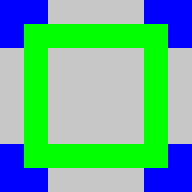

3 Squash
--------

Now that we have somewhat mastered the background times to move on to sprites, to do this we will make 1 player Squash.
This is 3 walls, a "racket" and ball that bounces. Hard to call it a "classic" but it is rather simple and will let me focus on the complexities of sprites, before using it as a base to make something that is truly classic in part 4. 

This will use PETSCII again but we will need to add new sprite definitions. We are also going to start with Tutorial's 2 code base to get us moving faster. 

So what do we need for Squash?
- a playing field with 3 walls
- a racket
- a ball
- a way to collide the ball with the walls
- a way to bounce the ball off the walls
- a way to collide the ball with the racket
- a way to bounce the ball off the racket

Firstly, lets modify SNakES to suit our new needs. Firstly, we can remove all the tail, head variables and logic, the snake buffer, up and down on the joypad. I will keep the random number generator although I don't perceive any use for it in this project, I will want in future and we have plenty of room. 

Another minor change I want to do is introduce some Macros, while I wish these projects to be as assembler agonistic as possible there gets a point where I can only tolerate using the basic levels while using the top class assembler that I use to avoid such tedium. However, I feel that adding a Macro is fairly common among all assemblers and these macros are nothing special. They should be trivial enough to port, or find and replace should you wish. 

What is a "Macro"? In its simplest form it is auto Copy Paste, but with 64tass at least you can get into making whole "macro languages" in it, to transform and auto generate code for you. We will not be getting that far, and these macros are very literal copy paste jobs. 

Take for example this line of code
~~~
rep #$20              ; A16
~~~

you have to remember the rep and sep and if that make its 8 or 16 and then 10/20/30 et cetera so you comment it to make it easier to remember and understand at a glance, you want to be 100% on top of the register sizes at all times. What if the comment was the code?
~~~
A16 .macro
rep #$20 ; A16
.endm 
~~~
this defines a macro called A16 that when "invoked" types out `rep #$20 ; A16` into the listing for us, as if we had typed it our self. 

64Tass has multiple ways you can invoke a macro. 

The `.` form so `.A16`

The `#` form so `#A16`

and finally, the naked form `A16`

personally, I normally use the naked form, but for somebody new to this and not familiar with the 65816 fully and 64tass, it may cause confusion with it being an Op Code that is supported by the 65816. Like wise the `.` form makes it look a like a directive and hence may cause people to look through the docs trying to find what it means and not being able to find it. So for these tutorials I will use the `#` form to make it more explicit. I may slip up out of habit though, so please let me know if I do. 

The full set of macros is as follows 
~~~
AXY16 .macro 
rep #$30 ; AXY 16
.endm

A16 .macro
rep #$20 ; A16
.endm 

XY16 .macro
rep #$10 ; XY16
.endm

AXY8 .macro 
sep #$30 ; AXY 8
.endm

A8 .macro
sep #$20 ; A8
.endm

XY8 .macro
sep #$10  ; X8   
.endm
~~~

place these at the very top of Master.asm. You can technically place a macro anywhere in the file. If you have an error in the code then the macros won't be found and then you will get cryptic error messages for every instance of said macro, and we are going to use these a lot, which will hide the true error. To help keep the errors more succinct and to limit their number I will place them "first thing". When you have a lot of macros this does make the listing hell though. 

thus your new start of `master.asm` is
~~~
AXY16 .macro 
rep #$30 ; AXY 16
.endm

A16 .macro
rep #$20 ; A16
.endm 

XY16 .macro
rep #$10 ; XY16
.endm

AXY8 .macro 
sep #$30 ; AXY 8
.endm

A8 .macro
sep #$20 ; A8
.endm

XY8 .macro
sep #$10  ; X8   
.endm

*=$000000               ; file offset
.logical $008000        ; memory address
.include "BANK00.asm"   ; put everything in BANK00.asm file here
.here                   ; exit out of the memory address and return to file address
*=$008000               ; file offset
.logical $018000        ; memory address
; .include "BANK01.asm" ; placeholder commented out for now
.here                   ; exit out of the memory address and return to file address
*=$010000               ; file offset
.logical $028000        ; memory address
; .include "BANK02.asm" ; placeholder commented out for now
.here                   ; exit out of the memory address and return to file address
*=$018000               ; file offset
.logical $038000        ; memory address
; .include "BANK03.asm" ; placeholder commented out for now
.here                   ; exit out of the memory address and return to file address
*=$01FFFF               ; make sure all 128K is output set we set the file offset to the last byte
.byte 0                 ; place empty byte to force full output
~~~

and the `BANK00.asm` with the unneeded code removed, the macros in place and a few other tweaks I will document after the listing is now
~~~
kJoypad .block
   BtnR      = 16
   BtnL      = 32
   BtnX      = 64
   BtnA      = 128
   DirRight  = 256
   DirLeft   = 512
   DirDown   = 1024
   DirUp     = 2048
   BtnStart  = 4096
   BtnSelect = 8192
   BtnY      = 16384
   BtnB      = 32768
.bend

*=$0
; DP variables go here
DPPointer1 .long ?
DPPointer2 .long ?

*=$100
; Normal variables go here
seed .byte ?
NMIDoneNF .byte ?

*=$200
ScreenMirror .fill $800

ScoreCounter     = ScreenMirror+(16*2)
BestScoreCounter = ScreenMirror+(27*2)

* = $8000
.as               ; Assume A8
.xs               ; Assume X8
.autsiz           ; Auto size detect
.databank $00     ; databank is 00
.dpage $0000      ; dpage is 0000
RESET
   clc
   xce ; enter 65816 mode
   #AXY16
   ldx #$1FFF
   txs      ; set the stack
   phk
   plb
   lda #0000
   tcd
   lda #$008f
   sta $2100      ; turn the screen off 
   lda #$8008     ; A -> B, FIXED SOURCE, WRITE BYTE | WRAM
   sta $4300
   lda #<>DMAZero ; 64Tass | get low word
   sta $4302
   lda #`DMAZero  ; 64Tass | get bank
   sta $4304
   stz $2181
   stz $2182      ; START AT 7E:0000
   stz $4305      ; DO 64K
   lda #$0001
   sta $420B      ; FIRE DMA
   sta $420B      ; FIRE IT AGAIN, FOR NEXT 64k
   #A16
   lda #$008F     ; FORCE BLANK, SET OBSEL TO 0
   sta $2100
   stz $2105 ;6
   stz $2107 ;8
   stz $2109 ;A
   stz $210B ;C
   stz $210D ;E
   stz $210D ;E
   stz $210F ;10
   stz $210F ;10
   stz $2111 ;12
   stz $2111 ;12
   stz $2113 ;14
   stz $2113 ;14
   stz $2119 ;1A to get Mode7
   stz $211B ;1C these are write twice
   stz $211B ;1C regs
   stz $211D ;1E
   stz $211D ;1E
   stz $211F ;20
   stz $211F ;20
   stz $2123 ;24
   stz $2125 ;26
   stz $2126 ;27 YES IT DOUBLES OH WELL
   stz $2128 ;29
   stz $212A ;2B
   stz $212C ;2D
   stz $212E ;2F
   stz $2130 ;31
   lda #$00E0
   sta $2132
   ;ONTO THE CPU I/O REGS
   lda #$FF00
   sta $4200
   stz $4202 ;3
   stz $4204 ;5
   stz $4206 ;7
   stz $4208 ;9
   stz $420A ;B
   stz $420C ;D   
   ; CLEAR VRAM
   #A16
   lda #$1809      ; A -> B, fixed source, write word | vram
   sta $4300
   lda #<>DMAZero  ; this get the low word, you will need to change if not using 64tass
   sta $4302
   lda #`DMAZero   ; this gets the bank, you will need to change if not using 64tass
   sta $4304       ; and the upper byte will be 0
   stz $4305       ; do 64k
   lda #$80        ; inc on hi write
   sta $2115
   stz $2116       ; start at $$0000
   lda #$01
   sta $420B       ; fire dma
   ; CLEAR CG-RAM
   lda #$2208      ; a -> b, fixed source, write byte | cg-ram
   sta $4300
   lda #$200       ; 512 bytes
   sta $4305
   #A8
   stz $2121       ; start at 0
   lda #$01
   sta $420B       ; fire dma
   ; DMA Petscii Font
   #AXY16
   lda #<>PETSCII_Chars
   sta $4302
   #A8
   lda #`PETSCII_Chars
   sta $4304
   ldx #size(PETSCII_Chars)
   stx $4305
   ldx #%00000001 | $1800   ; A->B, Inc, Write WORD, $2118
   stx $4300
   ldx #$1000
   stx $2116
   lda #$80
   sta $2115                ; inc VRAM port address
   lda #1
   sta $420B
   ; DMA Pallete
   ldx #<>PETSCII_Pal
   stx $4302
   lda #`PETSCII_Pal
   sta $4304
   ldx #16
   stx $4305
   ldx #%00000010 | $2200  ; A->B, Inc, Write 2 Bytes, $2122
   stx $4300
   stz $2121               ; start of Pallete
   lda #1
   sta $420B
   jsr clearGameScreen_aXY
   #A16
   ; the status row
   ldx #62
-   lda StatusRow,x
   sta ScreenMirror,x
   dex
   dex
   bpl -
   jsr DMAScreenToVRAM_ff
   #A8
   ; set up screen addresses
   stz $2107 ; we want the screen at $$0000 and size 32x32
   lda #1
   sta $210B ; we want BG1 tile data to be $$1000 which is the first 4K word step
   stz $2105 ; 8x8 chars and Mode 0
   lda #1
   sta $212c ; BG1 is on the Main Screen
   lda #$ff
   sta $210e ; we also need to scroll up 1 pixel ( so do -1 )
   lda #$03
   sta $210e ; because the first line is not drawn
   lda #$0f
   sta $2100 ; don't blank, so show the screen at full brightness
   ; enable NMI to get us a game loop
   lda #%10000001 ; enable NMI VBlanks and Gamepad scanning 
   sta $4200
   ; init game state
initGame_xx
   #A16
   lda #'0'
   sta ScoreCounter
   sta ScoreCounter+2
   sta ScoreCounter+4
   sta ScoreCounter+6

mainLoop
   #A8
   stz NMIDoneNF ; clear any pending NMI
-  lda NMIDoneNF ; wait for the next one
   bpl -
   ; NMI is finished so we can update
   #XY8
   ; update the heading direction
   lda $4218+1
   bit #>kJoypad.DirLeft
   beq _notLeft
      ldx #1
      bne _setNew
_notLeft
   bit #>kJoypad.DirRight
   beq _noMoveChange
      ldx #2
_setNew
_noMoveChange   
   #A8
   jmp mainLoop

.al
.xs
gameOver_Ax
   ldx #(8*2)
-  lda GameoverText,x
   sta ScreenMirror+(11*64)+(12*2),x
   dex
   dex
   bpl -
   lda ScoreCounter
   cmp BestScoreCounter
   beq _100s
   bcs _newBest
   bcc _noNewBest
_100s
   lda ScoreCounter+2
   cmp BestScoreCounter+2
   beq _10s
   bcs _newBest
   bcc _noNewBest
_10s
   lda ScoreCounter+4
   cmp BestScoreCounter+4
   beq _1s
   bcs _newBest
   bcc _noNewBest
_1s
   lda ScoreCounter+6
   cmp BestScoreCounter+6
   beq _noNewBest ; its the same score
   bcc _noNewBest
_newBest   
   ; new best score so copy the current one to the best
   ldx #6   
-  lda ScoreCounter,x   
   sta BestScoreCounter,x   
   dex      
   dex      
   bpl -      
_noNewBest   
   lda $4218
   and #kJoypad.BtnA|kJoypad.BtnB|kJoypad.BtnX|kJoypad.BtnY|kJoypad.BtnStart|kJoypad.BtnSelect
   beq _noNewBest ; actually wait for face button
   #A8
   #XY16
   jsr clearGameScreen_aXY
   jmp initGame_xx

.enc "screen"
                ;          1111111111122222222233
                ;01234567890123456789012345678901
StatusRow .word ' ','s','q','u','a','s','h',' ',' ',' ','s','c','o','r','e',':','0','0','0','0',' ',' ','b','e','s','t',':','0','0','0','0',' ' 
GameoverText .word 'g','a','m','e',' ','o','v','e','r'

DMAScreenToVRAM_ff
   php
   #XY16
   #A8
   ldx #$1801          ; A -> B, copy source, write word | vram
   stx $4300
   ldx #<>ScreenMirror ; this get the low word, you will need to change if not using 64tass
   stx $4302
   lda #`ScreenMirror  ; this gets the bank, you will need to change if not using 64tass
   sta $4304           ; and the upper byte will be 0
   ldx #$800           ; DMA counts bytes not words so we must give a byte size not a word size
   stx $4305           ; do $$400 words
   lda #$80            ; inc on hi write
   sta $2115
   stz $2116       
   stz $2117           ; start at $$0000
   lda #$01
   sta $420B           ; fire dma
   plp
   rts

.as
.xl
clearGameScreen_aXY
_ASSERT_a8
_ASSERT_xy16
    ; fill the screen with ' '
   ldx #$8008      ; A -> B, FIXED SOURCE, WRITE BYTE | WRAM
   stx $4300
   ldx #ScreenMirror+64
   stx $2181
   stz $2183       ; START AT 7E:ScreenMirror+64   
   ldx #<>DMASpace ; this get the low word, you will need to change if not using 64tass
   stx $4302
   lda #`DMASpace  ; this gets the bank, you will need to change if not using 64tass
   sta $4304       ; and the upper byte will be 0
   ldx #$800-64    ; DMA counts bytes not words so we must give a byte size not a word size
   stx $4305       ; do 2048-64 bytes
   lda #$01
   sta $420B       ; fire dma
   ; pre fill the Screen mirror with our arena
   ; first the outlines
   ; the top and bottom line
   #A16
   .enc 'screen'
   lda #'{space}'+128  ; solid char
   ldx #62
-  sta ScreenMirror+(1*32*2),x
   ; sta ScreenMirror+(23*32*2),x <- remove this line
   dex
   dex
   bpl -
   ; the veritcal lines
   lda #ScreenMirror+(2*32*2)
   sta DPPointer1
   ldx #20
-  lda #'{space}'+128  ; solid char
   ldy #0
   sta (DPPointer1),y
   ldy #31*2
   sta (DPPointer1),y
   clc
   lda DPPointer1
   adc #32*2
   sta DPPointer1
   dex
   bpl -
   #A8 ; return with A8 as promised
   rts
   
.as   
.xs   
getRND_ad
_ASSERT_a8
   lda seed
   beq _doEor
      asl
      beq _noEor ;if the input was $80, skip the EOR
      bcc _noEor
_doEor
   eor #$1d
_noEor  
   sta seed
   rts
         
NMI_ISR
   #AXY16
   pha
   phx
   phy
   phb
   phk
   plb
   jsr DMAScreenToVRAM_ff
   #A8
   lda #$ff
   sta NMIDoneNF
   jsr getRND_ad ; throw away a random number to improve randomness
   #A16
   plb
   ply
   plx
   pla
justRTI
   rti

.enc "screen" ; tell 64Tass we want the text to be written in C64 Screen codes encoding
DMASpace .word ' '

PETSCII_Chars .binary "petscii.chr"

PETSCII_Pal .binary "petscii.pal"
.word %0_00000_00000_00000 ; 0, 0, 0 BGR
.word %0_00000_00000_11111 ; 0, 0,31 BGR
.word %0_00000_00000_00000 ; 0, 0, 0 BGR
.word %0_00000_00000_00000 ; 0, 0, 0 BGR

* = $ffb0
    .enc "none"
DMAZero
    .fill 16,0
    ;               111111111112
    ;      123456789012345678901
    .text "this is a dummy name "
.cerror * != $00ffd5, "name is too short", *
    .byte $20   ; Mapping
    .byte $00   ; Rom
    .byte $07   ; 128K
    .byte $00   ; 0 SRAM
    .byte $02   ; PAL
    .byte $33   ; Version 3
    .byte $00   ; rom version 0
    .word $FFFF ; complement
    .word $0000 ; CRC
    
; 65816 vectors
* = $ffe4
v16_COP    .word justRTI
v16_BRK    .word justRTI
v16_ABORT  .word justRTI
v16_NMI    .word NMI_ISR
v16_RESET  .word justRTI
v16_IRQ    .word justRTI

; 6502 vectors
* = $fff4
v02_COP    .word justRTI
v02_BRK    .word justRTI
v02_ABORT  .word justRTI
v02_NMI    .word justRTI
v02_RESET  .word RESET
v02_IRQ    .word justRTI   
~~~
As you can see most variables have been removed but I've keep the score and highscore ones, renaming them to a more meaningful `ScoreCounter` and `BestScoreCounter` respectively.

The joypad reading code has been reduced to just left and right as follows
~~~
; update the heading direction
   lda $4218+1
   bit #>kJoypad.DirLeft
   beq _notLeft
      ldx #1
      bne _setNew
_notLeft
   bit #>kJoypad.DirRight
   beq _noMoveChange
      ldx #2
_setNew
_noMoveChange   
~~~

And to draw 3 walls rather than the 4 walls of SNakES `ClearGameScreen` had 1 line commented out
~~~
   lda #'{space}'+128  ; solid char
   ldx #62
-  sta ScreenMirror+(1*32*2),x
   ; sta ScreenMirror+(23*32*2),x <- remove this line
   dex
   dex
   bpl -
~~~

and I changed the status name
~~~
StatusRow .word ' ','s','q','u','a','s','h',' ',' ',' ','s','c','o','r','e',':','0','0','0','0',' ',' ','b','e','s','t',':','0','0','0','0',' ' 
~~~

SPRITES!

Wonderful little things, you can just move things over other things and all you have to do is update the X and Y. So convenient. Somethings call them Sprites, some Objects, some MOBs for Movable OBjects. The SNES is a sprite powerhouse, 128, up to 64x64, 32 sprites per line, 8 pallets to choose from with 15 colours + transparent and you can even use transparency blending on some of them. Sadly, you can only access 16K of definitions data and they are locked to 4bpp mode so you can't eek out more sprites by making some 2bpp sprites definitions. 

Sprites are always positioned in screen space and as such they only have a 9bit X position... yeah 9bits and stored in the worse way possible.. worse than $d010 on a C64 is you know that horror even.

OAM has "two halfs" although it’s not actually split in half and the memory is continuous. You have for each sprite 4 bytes of definition store in the lower "half" and then 2 bits per sprite packed into bytes in the upper "half". 

The first half is thus 128*4 bytes = 512bytes. And the upper half if 128/4 = 32 bytes for a total of 546bytes. yeah...

For this very basic introduction I'm going to make all sprites be visible on the screen so we don't need to do any 9 bit maths, and all sprites will be the same size. To this end the upper 32bits will all be set to 0 upon init and we won't modify them again for the remainder of this tutorial. I will save that pain for another day in the future.

As with the screen we will make a Mirror that is then DMA'd to OAM (Object Attribute Memory) during VBlank. 

Add this to the variable definitions after Screen Mirror.
~~~
OAMMirror     .fill 512
OAMMirrorHigh .fill 32
~~~

For an in-depth guide on them and more reasons why we have to do what we are about to do, please watch my video on them here https://www.youtube.com/watch?v=8YowrDT9cB8

But you might think we need to set this to 0 and that way the sprites will be "off".

NO

0,0 is the top left of the screen, so any sprite at 0,0 will be active and visible. We have to set them offscreen, which the SNES calls a Y=240. Normally I would set them Y=240, X=-239 but we are not going to touch the upper half this tutorial so Y=240, X=240 will have to do for now. To do this we will fill the OAMMirror with 240 and the High with 0 to make them small and 0-256 on the X. With our ole pal DMA. 

~~~
ClearOAMMirror_ff
   php
   #XY16
   #A8
   ldx #$8008      ; A -> B, FIXED SOURCE, WRITE BYTE | WRAM
   stx $4300
   ldx #OAMMirror
   stx $2181
   stz $2183       ; START AT 7E:OAMMirror
   ldx #<>DMA240   ; this get the low word, you will need to change if not using 64tass
   stx $4302
   lda #`DMA240    ; this gets the bank, you will need to change if not using 64tass
   sta $4304       ; and the upper byte will be 0
   ldx #512
   stx $4305
   lda #$01
   sta $420b
   ; now we clear the High part
   ; the WRAM port is already in place
   ldx #<>DMAZero   ; this get the low word, you will need to change if not using 64tass
   stx $4302
   lda #`DMAZero    ; this gets the bank, you will need to change if not using 64tass
   sta $4304        ; and the upper byte will be 0
   ldx #32
   stx $4305
   lda #$01
   sta $420b
   plp
   rts
   
DMAOAMMirrorToOAM_ff
   php
   #XY16
   #A8
   ldx #$0402       ; A -> B, INC SOURCE, WRITE BYTE,BYTE TWICE | OAMDATA
   stx $4300
   stz $2102        ; START AT OAM $0000
   stz $2103        ; PRIORITY 0
   ldx #<>OAMMirror ; this get the low word, you will need to change if not using 64tass
   stx $4302
   lda #`OAMMirror  ; this gets the bank, you will need to change if not using 64tass
   sta $4304        ; and the upper byte will be 0
   ldx #512+32
   stx $4305
   lda #$01
   sta $420b
   plp
   rts
~~~
The first function should be pretty self-explanatory by this point, it’s a fixed DMA to WRAM port of two different sizes to init the OAM Mirror as we have done before. 

The second function is new however. 

OAM is a very odd beast. Again, we address it in WORDs as we can only set a 9 bit address but 10bits is needed to address all of the data. This is achieved by indexing into words. I.E when we write the address we want it shift it up 1 and the hardware sets the lower bit to 0 internally. No idea. However, unlike VRAM where we have a WORDs worth of Port registers, we only have a BYTE worth of Port registers, that is a single byte. Which we must write twice to write a whole WORD worth of data. 
Well mostly, when writing the lower half I.E., 0-512 (byte address) you need to write twice otherwise the data won't be stored. However, for the upper half I.E., 512-543 (byte address) the byte data will be transferred instantly. Also, this address works at the byte level not the word level. This make life somewhat confusing and I don't recommend you directly interact with OAM for this reason, rather set things in the Mirror and DMA all at once to be Sure _Sure_. 

To do this we DMA with type 2 -> xx, xx which is write to the same memory address in a pair, the OAM register always increments there is no way to stop it, we init its position to 0, this will not technically be necessary in future as it will latch whatever we set it to and restore it again automatically, but I don't care and will do it every time regardless. 

Then we DMA 512+32 bytes to it. 

I added calls to it, after the VRAM clear and before the PETSCII upload, as follows
~~~
   ; INIT OAM Mirror
   jsr ClearOAMMirror_ff
   ; INIT OAM
   jsr DMAOAMMirrorToOAM_ff
   ; DMA Petscii Font
~~~
Also add a call to `jsr DMAOAMMirrorToOAM_ff` in the NMI ISR after the ScreenToVRAM call. This way things will auto update once we start actually filling in sprites. 

If you run this now, you should see nothing different, hopefully. And then if you open the Sprites view in Mesen-S you should see that all the sprites a light grey, denoting that they are all offscreen. If you hit the toggle down the bottom, you should be left with an empty list. 

We have our OAM set up and our Mirror transfer all set up, now we need something to show. We need to make some new tiles in 4bpp/16 colour layout and upload them to VRAM. 

I have provided a `ballAndRacket.png` for you which has 3 8x8 chars in it. The first is the ball, and the next 2 will be used to build the racket. Again, I will be using `superfamiconv` and the invocation for sprites in this instance is `superfamiconv.exe -i .\ballAndRacket.png -p sprite.pal -t sprite.chr -S -R -D -F` the -R, D and F are probably not necessary, but with this program I take no chances ;) 

Now you will have a `sprite.pal` which we need to upload to CGRAM starting at slot 128, as the sprite uses the upper 8 pallets of CGRAM, and a `sprite.chr` which needs to go into VRAM, I like to store my sprites in the last 16K of VRAM which is $$6000 
> Remember $$ for Word VRAM addresses/sizes and $ for Byte addresses/sizes

Firstly, we need to include the binary files into a code, I have placed mine after the other binary files and before the header, as follows
~~~
Sprite_Chars .binary "sprite.chr"
Sprite_Pal .binary "sprite.pal"

* = $ffb0
~~~
> remember to keep the .binary on the same line as the label, so the size of command will work!

Basically the same DMA we do for the Screen chars and pal, just with different offsets in to VRAM and CGRAM. Right after the Screen DMAs `jsr clearGameScreen_aXY` add 
~~~
   ; DMA Sprite Chars
   ldx #<>Sprite_Chars
   stx $4302
   lda #`Sprite_Chars
   sta $4304
   ldx #size(Sprite_Chars)
   stx $4305
   ldx #%00000001 | $1800   ; A->B, Inc, Write WORD, $2118
   stx $4300
   ldx #$6000                ; put Sprites chars at $$6000/$C000
   stx $2116
   lda #$80
   sta $2115                ; inc VRAM port address
   lda #1
   sta $420B
   ; DMA Pallete
   ldx #<>Sprite_Pal
   stx $4302
   lda #`Sprite_Pal
   sta $4304
   ldx #16
   stx $4305
   ldx #%00000010 | $2200  ; A->B, Inc, Write 2 Bytes, $2122
   stx $4300
   lda #128                  ; sprite pal starts at entry 128
   sta $2121
   lda #1
   sta $420B
   ~~~

so we have tile data, pallete data, OAM mirror. Now we have to tell the PPU where are sprite tiles are stored, what size sprites we want, and most importantly of all _ENABLE_ them. 

$2101 is where we tell the SNES what to put where, it is rather cryptic however 
~~~
2101h - OBSEL - Object Size and Object Base (W)

  7-5   OBJ Size Selection  (0-5, see below) (6-7=Reserved)
         Val Small  Large
         0 = 8x8    16x16    ;Caution:
         1 = 8x8    32x32    ;In 224-lines mode, OBJs with 64-pixel height
         2 = 8x8    64x64    ;may wrap from lower to upper screen border.
         3 = 16x16  32x32    ;In 239-lines mode, the same problem applies
         4 = 16x16  64x64    ;also for OBJs with 32-pixel height.
         5 = 32x32  64x64
         6 = 16x32  32x64 (undocumented)
         7 = 16x32  32x32 (undocumented)
        (Ie. a setting of 0 means Small OBJs=8x8, Large OBJs=16x16 pixels)
        (Whether an OBJ is "small" or "large" is selected by a bit in OAM)
  4-3   Gap between OBJ 0FFh and 100h (0=None) (4K-word steps) (8K-byte steps)
  2-0   Base Address for OBJ Tiles 000h..0FFh  (8K-word steps) (16K-byte steps)
~~~

For this game we will be using 8x8, and I will choose 8x8 and 16x16 mode so that gives us %000

The gap between the two halves of Sprite chars definitions will also be 0 for this game. For what this means see the video I posted above. So again 00

Now the Base Address note the 8K word specify. Your sprites must start on a "8K" boundary. ie. `$$0000,$$2000,$$4000,$$6000` and you choose which "16K/8KW block" you want your sprites tiles to be in. I have uploaded to `$$6000` so I will choose _block_ 3 thus %00000011. 

The way the SNES determines where in Memory a Sprite chars are located is given by the `Base Address above + (sprite char number / 16 * $$100) + (sprite char number % 8 * $$10)` which is rather complicated looking, but visually is rather obvious. Sprite chars are drawn in 16 8x8 wide sets. 
~~~
+--+--+--+--+--+--+--+--+--+--+--+--+--+--+--+--+
|0 |1 |2 |3 |4 |5 |6 |7 |8 |9 |10|11|12|13|14|15|
+--+--+--+--+--+--+--+--+--+--+--+--+--+--+--+--+
|16|17|18|19|20|21|22|23|24|25|26|27|28|29|30|31|
+--+--+--+--+--+--+--+--+--+--+--+--+--+--+--+--+
....
~~~
The Char number is always counter in an 8x8 size grid, so you must specify the char number as if it was 8x8 no matter what size sprite you are drawing. Then it is simply a case of row * 16 + column. 

In this case the ball is char 0, the left edge of the bat is 1 and the middle of the bat is 2, the right edge will also be 1. 

Now lets add the 1 line we need to set up the sprites into the code. Before ` ; init game state` add 
~~~
lda #3
sta $2101
~~~
Next, we need to enable them, on the Main Screen in this case. Which is done by setting bit 4 on $212c, so scroll up a bit from the previous code we added and find
~~~
lda #1
sta $212c ; BG1 is on the Main Screen
~~~
and change it the `lda #$11`

We have dma'd in data, set up the pallet, told the SNES where the tiles are, set the sizes we want, and turned them on the Screen and set up the Mirror DMA. Now we should be good to go, and set up our first sprite to actually show on the screen!

Let us hard code one for now to verify everything is working as expected. 
the Object attributes are defined as
~~~
OAM (Object Attribute Memory)
Contains data for 128 OBJs. OAM Size is 512+32 Bytes. The first part (512 bytes) contains 128 4-byte entries for each OBJ:

  Byte 0 - X-Coordinate (lower 8bit) (upper 1bit at end of OAM)
  Byte 1 - Y-Coordinate (all 8bits)
  Byte 2 - Tile Number  (lower 8bit) (upper 1bit within Attributes)
  Byte 3 - Attributes

Attributes:

  Bit7    Y-Flip (0=Normal, 1=Mirror Vertically)
  Bit6    X-Flip (0=Normal, 1=Mirror Horizontally)
  Bit5-4  Priority relative to BG (0=Low..3=High)
  Bit3-1  Palette Number (0-7) (OBJ Palette 4-7 can use Color Math via CGADSUB)
  Bit0    Tile Number (upper 1bit)
~~~

Let us place the ball at the middle of the screen, just before `mainLoop` add
~~~
   #A8
   lda #128            ; x at 128
   sta OAMMirror
   lda #112            ; y at 122
   sta OAMMirror+1
   lda #0            ; tile number 0
   sta OAMMirror+2
   lda #0            ; tile number 0, pal 0, no flipped, normal priority
   sta OAMMirror+3
~~~
this will place the first sprite at 128,122 and uses tile 0 with pal 0. Run the ROM and you should be greeted with a ball in the middle of the screen. 

Well, it's not really in the middle of the screen is it, it’s a little off the middle of the screen. This is because sprites are positioned by the Top Left corner so the top left corner of the sprite is in the middle of the screen. To fix this we need to -4 on the x and y to make the middle of the sprite be in the middle of the screen, give or take a pixel. 
~~~
   lda #128-4         ; x at 128
   sta OAMMirror
   lda #112-4         ; y at 122
   sta OAMMirror+1
~~~
Run again, there that is better isn't it. 

Let’s do this properly, we need a variable to hold the ball's X and Y and we will want a X delta and a Y delta. This way we can make it move every frame. 

Lets call them
BallX
BallY
BallDeltaX
BallDeltaY
and make them bytes. 

Now we can update or "spawn sprite" code, to also init these variables. 
~~~
   lda #128-4         ; x at 128
   sta OAMMirror
   sta BallX
   lda #112-4         ; y at 122
   sta OAMMirror+1
   sta BallY
   lda #0            ; tile number 0
   sta OAMMirror+2
   lda #0            ; tile number 0, pal 0, no flipped, normal priority
   sta OAMMirror+3
   lda #1
   sta BallDeltaX
   sta BallDeltaY   
~~~
then at the top of the main loop after the wait for NMI code we need to add the deltas to the X and Y, then store the new positing into the OAM buffer. We could actually just define BallX and BallY to be OAMBuffer entries. It would be fine for this example but eventually we are going to have dynamic sprite layout so I don't want to start you down that habit. 
~~~
   ; NMI is finished so we can update
   ; update the ball
   lda BallX
   clc
   adc BallDeltaX
   sta BallX
   sec
   sbc #4         ; update the position from centre to top left
   sta OAMMirror
   lda BallY
   clc
   adc BallDeltaY
   sta BallY
   sec
   sbc #4         ; update the position from centre to top left
   sta OAMMirror+1
   #XY8
~~~
Now run the game and you will see the ball moves 45 degrees down at a steady rate. Then once it gets to the bottom it eventually wraps up the top of the screen. If you are observant, you will have noticed that the sprite is behind the text not over the text as it goes past it. This is because the priority is set to 0 in its attributes, if you set the 4th attribute to be %00110000 instead then it will appear above everything and hence be on top of the text. For this game having it behind is good, but if you fill in the background with something more interesting for example, your sprites would be invisible, an all too common pitfall I'm afraid.

Collision!

We can't have it just keep going off the screen and wrapping around, it needs to bounce back. For this we will use the simplest form of collision "hard lines". Sure, we could make some fancy tile collision system and work out that we hit the tile and then bounce back, but why? Pointless overkill, the way to succeed on the SNES is to do what is needed and only what is needed. 

The left wall has an inner edge on the 8th pixel right? The ball has a radius of 4, so once the ball's X gets to or below 12 then it will hit the right wall. It doesn't move, so a simple check on the position will work fine. The far wall has an inner edge on the 248nd pixel right? and again radius of 4, so once it hits 244 then it hit the left wall. 
Likewise, the top wall is 16th pixel down, so once the Y gets above or equal to 20 it hit the top wall. For now, we will also put in the bottom wall at 220, we don't want to have to deal with it missing and restarting the game to test all our collision cases, that is just a waste of time. 

How do we flip the order? 
When we collide on the X axis we negate the X Delta and when we collide on the Y axis we negate the Y Delta. Sadly the 65816 doesn't have a build in neg opcode so we will have to do it the __long__ way which is 
~~~
   eor #$ff   
   clc   
   adc #1
~~~
Thus, the wall collision code becomes
~~~
lda BallX
   cmp #12
   bcc _flipX
   cmp #244
   bcs _flipX
_checkY
   lda BallY
   cmp #20
   bcc _flipY
   cmp #220
   bcc _wallCollisionDone
   _flipY
      lda BallDeltaY   
      eor #$ff   
      clc   
      adc #1   
      sta BallDeltaY
      bra _wallCollisionDone
   _flipX
      lda BallDeltaX
      eor #$ff   
      clc   
      adc #1   
      sta BallDeltaX
      bra _checkY
_wallCollisionDone
~~~
place it right after the `sta OAMMirror+1` code we added above and before the `#XY8`, now when you reload the ROM, you will see the ball bounce around the screen and stay in bounds. 

Now we need a racket. 

The racket will use sprites 1,2 and 3. And it will be made out of char 1, char 2, and char 1 X flipped. This makes it 24 pixels wide. So let’s add a RacketX and RacketY and Init the OAMMirror with these details. 

Let’s be smart about this, firstly let’s make some constant defines
~~~
kRacketStartX = 128
kRacketStartY = 188
~~~
I will place the racket just below the bottom edge of the white walls. 

Then rather than write code to fill in the 3 sprites, let’s make a table and copy it in a loop, so place the table below the end of the main function, 
~~~
RacketSpriteTable 
   .byte kRacketStartX-12,kRacketStartY-4,1,0
   .byte kRacketStartX-4,kRacketStartY-4,2,0
   .byte kRacketStartX+4,kRacketStartY-4,1,$40
~~~
Since the X, Y position is for the middle and we are 24 pixels wide we -12 to get the left most edge, then add 8 then add 8. Y is the same for all 3, and is -4 as again the racket is 8 pixels high and the tiles are 1,2,1 and then we set bit 6 on the Attributes to flip it on the X. Normally you would make some defines to help with these but I feel it is important for you to see the raw bits to understand how it works rather than a bunch of text that hides the details. We will use better systems in future tutorials. 

Add two variables to hold the X and Y for the Racket
~~~
RacketX .byte ?
RacketY .byte ?
~~~
And then add the code to copy the sprite data and init the Sprite data below the other sprite init code we have, as follows
~~~
   ldx #11
-  lda RacketSpriteTable,x
   sta OAMMirror+4,x
   dex
   bpl -
   lda #kRacketStartX
   sta RacketX
   lda #kRacketStartY
   sta RacketY
~~~
and run the game, now you should see a racket in the middle at the bottom of the white walls. 

Now we need to get it moving, luckily, we have the joypad reading code from SNakES still, so all we need to do is add some code to the left and right that will move it either left or right. We can't let it get below 12 and we can't let it get above 244 so it remains on the screen. We will then need to write code that will update the sprite X's from the position. 
~~~
   #XY8
   ; update the heading direction
   lda $4218+1
   bit #>kJoypad.DirLeft
   beq _notLeft
      lda RacketX
      cmp #13           ; add 1 because 
      bcc _noMoveChange ; this is < not <=
      sec
      sbc #1
      sta RacketX
      bra _setNew
_notLeft
   bit #>kJoypad.DirRight
   beq _noMoveChange
      lda RacketX
      cmp #244
      bcS _noMoveChange
      clc
      adc #1
      sta RacketX
_setNew
   lda RacketX
   sec
   sbc #12
   sta OAMMirror+4
   clc
   adc #8
   sta OAMMirror+8
   clc
   adc #8
   sta OAMMirror+12
_noMoveChange   
~~~
nothing complex to this, only the slight trap of the bcc being `<` and not `<=` so we need to compare against 13 not 12 to stop it in the right place. 

Run and now you should be able to move the racket left and right and it should stop at both screen edges. 

Great.. pity the ball just sails through it though.. so once again we have 

Collision! 

Now maybe you have done some computer science course, or maybe even something games programming related or read a bunch of books, or online tutorials and right now you are saying "the fastest collision is to do a circle distance check”.

And if you are on a machine with a large int and has fast multiply in a single clock, YES. On a SNES no.. even though we have 2 multiply in 8 clocks + large set up costs and we have a 16bit register that can hold and compare are max 0-256 values to square, still not a great idea for this instance. If you had large circles, say Baby Mario in Yoshi Island 2, sure you want to do some sphere testing for this no. 

AABB is the way.. well it’s not but we will start with it. 

For the collision let’s take an AABB that is 6 pixels in size, this is shown by the green square. Its close enough to accurate that nobody would really notice the difference. 

Now we like wise make a rectangle for the Racket. This one is 24 wide and 4 high from the top to the middle, we don't want the whole thing to collide, if you catch something on the bottom pixel of the Racket then, you missed it!

We know that the Ball is smaller than the Racket and we can use that to are advantage in this fixed collision function. I.E we know that the ball cannot contain the entire racket on the X so we don't need to check that case. What we do need to check is that the Ball Top Y is between active Y area of the Racket and/ or the Bottom Y is between active Y area of the Racket. Since the Ball is 8 pixels high and the Racket it only 4 for collisions sake, we have the case where the Top of the Ball is above the Racket collision and the bottom is below it. 

But this can be simplified. 
If the bottom of the Ball is below or equal to the top of the Racket and

If the top of the Ball is above or equal to the bottom of the Racket then it can be said to be intersecting. 

In high level language this is `if Ball.Y-4 <= Racket.Y && Ball.Y+4 >= Racket.Y-4` once we have the Y known to be potentially colliding, we then need to check the X. In this case using Y as the trivial discard first makes sense as the Racket is fixed on the Y. 

We can then do the same for the X. In that if the right edge of the Ball is >= left edge of the Racket and the left edge of the Ball is <= right edge of the Racket.

Once you have understood how that works, you may need to read it a few times, make some diagrams, get some post it notes and play it out on desk etc We can optimise this a step further. 

Picture the two rectangles in your head the small Ball one, and the larger Racket one and make them touch so that they are colliding. 

Now shrink the Ball by 1 pixel and expand the Racket's by 1 pixel, they still collide, and will still collide for all the same points they collided before. Because while one moved further away the other moved closer. 

Repeat it, and again and again until the Ball is now but a single pixel, a _point_ and the Racket is now 8 pixels thicker to compensate. So now we have an AABB and a point. That is a lot easier to deal with. 

If Racket Top Y <= BallY <= Racket Bottom Y && Racket Left X <= BallX <= Racket Right X. 

We can use subtraction and compare to test these equalities. 

If BallY - Racket Top Y >= 0 and <= Racket Height 

likewise with the X. 
The new top of the racket is given by Racket.Y - Racket.Height - Ball.Height/2 
The new bottom of the racket is given by Racket.Y + Ball.Height/2
The new thickness is Racket.Height + Ball.Height
Let's make some defines first 
~~~
kRacketColWidth = 24
kRacketColHeight = 4

kBallColWidth = 6
kBallColHeight = 6
~~~
This will make the formula stand out a lot more.

Let’s look at some code
~~~
_wallCollisionDone
   lda BallY
   sec
   sbc RacketY                               ; this is the middle Y
   clc                                     ; we would subtract this from RacketY which would cause
   adc #kRacketColHeight+kBallColHeight/2  ; us to subtract 4 less, so we add 4 to compensate
   bmi _YOutOfRange                         ; the Racket Y was too much pushing us negative, so ball is above           
   cmp #kRacketColHeight+kBallColHeight    ; is it less than the thickness of the expanded Racket
   bcs _yOutOfRange                         ; it is over
      ; Y in range, lets check the X
      lda BallX
      sec
      sbc RacketX
      clc
      adc #kRacketColWidth/2+kBallColWidth/2
      bmi _YOutOfRange                     ; actually is X but why make 2 labels
      cmp #kRacketColWidth+kBallColWidth
      bcs _YOutOfRange
         ; we hit the bat
         lda BallDeltaY
         eor #$ff   
         clc   
         adc #1   
         sta BallDeltaY
         jsr awardPoint_ax         
_YOutOfRange
~~~
BallY and RacketY are middle Ys. 

So first we want to do BallY - RacketTopY, to get the accumulator holding the distance between the two. We don't have the Top Y we have the Middle Y, to get to the TopY we have to subtract the RacketColHeight from it, but that is a pain to do 65816, well you could do it, negate it then add but this way is simpler. If you subtract something from a number you are going to subtract with, you subtract "less" so the way you do this is then add that value to the result. 
I.E. A - (B-C) = (A-B) + C 

We want all of the RacketHeight because it is on top of the middle not around the middle and we expand it by half ball collision width. 

If this value is negative then we know that the BallY was less than the Top Y of the Expanded Racket Collision volume and hence its "above" us. Now the accumulator holds the distance from the Top Y of the Expanded Racket Collision to the Ball Y Point. If this is less than the height of the Collision Volume, then the Y is in range and we have to check the X, if it is greater, the Ball is "below" us. 

The X is basically identical, just we start with Width/2 because the collision volume is about the centre not to one side of it. 

If both are in range, then we hit, flip the Y and award a point. This time I made the award point function a loop and it is as follows

~~~
.as
.xs
.enc "screen"
awardPoint_ax
   ldx #6
-  lda ScoreCounter,x
   clc
   adc #1
   sta ScoreCounter,x
   cmp #'9'
   bne _exit
      lda #'0'
      sta ScoreCounter,x
      dex
      dex
      bpl -
_exit
   rts
~~~

Nothing special and you should be able to follow what it does from previous versions. 

Slight issue with the game, it’s impossible to hit the ball at the start. Change the 128 to 32
~~~
   #A8
   lda #32            ; x at 32
   sta OAMMirror
   sta BallX
~~~

You may have also noticed a slight issue when you catch the ball on the side that it will bounce rapidly inside the collision volume. We can fix this by only testing the collision if the BallDeltaY is positive, I.E. if its moving up don't test the collision with the Racket.

~~~
_wallCollisionDone
   lda BallDeltaY
   bmi _YOutOfRange
~~~

Now we can remove the safety wall at the bottom and make it a game. Rather than flip Y when we collide with the bottom wall, jump to the `gameOver_Ax` function from SNakES, make sure you set the registers to the right size first though and restore them for the assembler __AFTER__!

~~~
   bcc _wallCollisionDone
      #XY8
      #A16
      jmp gameOver_Ax
      .as ; since this code jumps, we have to restore the before sizes for the assembler otherwise
      .xs ; it will assemble below this point with Axy which is wrong and the code will crash
   _flipY
~~~
To be safe, I made the XY size explicit in the initGame_xx function.
~~~
initGame_xx
   #A16
   lda #'0'
   sta ScoreCounter
   sta ScoreCounter+2
   sta ScoreCounter+4
   sta ScoreCounter+6
   #AXY8               <-update this to also set XY to 8bits 
   lda #32            ; x at 32
~~~

And that is a rather lame version of Squash, however the collision and sprites was the lesson not a great game of squash. 

Next time we will add ball to background collision by making this into Arknoid/Breakout. 

Final Bank00.asm code is as follow 

click to reveal code

~~~
kJoypad .block
   BtnR      = 16
   BtnL      = 32
   BtnX      = 64
   BtnA      = 128
   DirRight  = 256
   DirLeft   = 512
   DirDown   = 1024
   DirUp     = 2048
   BtnStart  = 4096
   BtnSelect = 8192
   BtnY      = 16384
   BtnB      = 32768
.bend

kRacketStartX = 128
kRacketStartY = 188

kRacketColWidth = 24
kRacketColHeight = 4

kBallColWidth = 6
kBallColHeight = 6

*=$0
; DP variables go here
DPPointer1 .long ?
DPPointer2 .long ?

*=$100
; Normal variables go here
seed .byte ?
NMIDoneNF .byte ?
BallX .byte ?
BallY .byte ?
BallDeltaX .byte ?
BallDeltaY .byte ?
RacketX .byte ?
RacketY .byte ?

*=$200
ScreenMirror  .fill $800
OAMMirror     .fill 512
OAMMirrorHigh .fill 32

ScoreCounter     = ScreenMirror+(16*2)
BestScoreCounter = ScreenMirror+(27*2)

* = $8000
.as               ; Assume A8
.xs               ; Assume X8
.autsiz           ; Auto size detect
.databank $00     ; databank is 00
.dpage $0000      ; dpage is 0000
RESET
   clc
   xce ; enter 65816 mode
   #AXY16
   ldx #$1FFF
   txs      ; set the stack
   phk
   plb
   lda #0000
   tcd
   lda #$008f
   sta $2100      ; turn the screen off 
   lda #$8008     ; A -> B, FIXED SOURCE, WRITE BYTE | WRAM
   sta $4300
   lda #<>DMAZero ; 64Tass | get low word
   sta $4302
   lda #`DMAZero  ; 64Tass | get bank
   sta $4304
   stz $2181
   stz $2182      ; START AT 7E:0000
   stz $4305      ; DO 64K
   lda #$0001
   sta $420B      ; FIRE DMA
   sta $420B      ; FIRE IT AGAIN, FOR NEXT 64k
   #A16
   lda #$008F     ; FORCE BLANK, SET OBSEL TO 0
   sta $2100
   stz $2105 ;6
   stz $2107 ;8
   stz $2109 ;A
   stz $210B ;C
   stz $210D ;E
   stz $210D ;E
   stz $210F ;10
   stz $210F ;10
   stz $2111 ;12
   stz $2111 ;12
   stz $2113 ;14
   stz $2113 ;14
   stz $2119 ;1A to get Mode7
   stz $211B ;1C these are write twice
   stz $211B ;1C regs
   stz $211D ;1E
   stz $211D ;1E
   stz $211F ;20
   stz $211F ;20
   stz $2123 ;24
   stz $2125 ;26
   stz $2126 ;27 YES IT DOUBLES OH WELL
   stz $2128 ;29
   stz $212A ;2B
   stz $212C ;2D
   stz $212E ;2F
   stz $2130 ;31
   lda #$00E0
   sta $2132
   ;ONTO THE CPU I/O REGS
   lda #$FF00
   sta $4200
   stz $4202 ;3
   stz $4204 ;5
   stz $4206 ;7
   stz $4208 ;9
   stz $420A ;B
   stz $420C ;D   
   ; CLEAR VRAM
   #A16
   lda #$1809      ; A -> B, fixed source, write word | vram
   sta $4300
   lda #<>DMAZero  ; this get the low word, you will need to change if not using 64tass
   sta $4302
   lda #`DMAZero   ; this gets the bank, you will need to change if not using 64tass
   sta $4304       ; and the upper byte will be 0
   stz $4305       ; do 64k
   lda #$80        ; inc on hi write
   sta $2115
   stz $2116       ; start at $$0000
   lda #$01
   sta $420B       ; fire dma
   ; CLEAR CG-RAM
   lda #$2208      ; a -> b, fixed source, write byte | cg-ram
   sta $4300
   lda #$200       ; 512 bytes
   sta $4305
   #A8
   stz $2121       ; start at 0
   lda #$01
   sta $420B       ; fire dma
   ; INIT OAM Mirror
   jsr ClearOAMMirror_ff
   ; INIT OAM
   jsr DMAOAMMirrorToOAM_ff
   ; DMA Petscii Font
   #AXY16
   lda #<>PETSCII_Chars
   sta $4302
   #A8
   lda #`PETSCII_Chars
   sta $4304
   ldx #size(PETSCII_Chars)
   stx $4305
   ldx #%00000001 | $1800   ; A->B, Inc, Write WORD, $2118
   stx $4300
   ldx #$1000
   stx $2116
   lda #$80
   sta $2115                ; inc VRAM port address
   lda #1
   sta $420B
   ; DMA Pallete
   ldx #<>PETSCII_Pal
   stx $4302
   lda #`PETSCII_Pal
   sta $4304
   ldx #16
   stx $4305
   ldx #%00000010 | $2200  ; A->B, Inc, Write 2 Bytes, $2122
   stx $4300
   stz $2121               ; start of Pallete
   lda #1
   sta $420B
   jsr clearGameScreen_aXY
   ; DMA Sprite Chars
   ldx #<>Sprite_Chars
   stx $4302
   lda #`Sprite_Chars
   sta $4304
   ldx #size(Sprite_Chars)
   stx $4305
   ldx #%00000001 | $1800   ; A->B, Inc, Write WORD, $2118
   stx $4300
   ldx #$6000                ; put Sprites chars at $$6000/$C000
   stx $2116
   lda #$80
   sta $2115                ; inc VRAM port address
   lda #1
   sta $420B
   ; DMA Pallete
   ldx #<>Sprite_Pal
   stx $4302
   lda #`Sprite_Pal
   sta $4304
   ldx #16
   stx $4305
   ldx #%00000010 | $2200  ; A->B, Inc, Write 2 Bytes, $2122
   stx $4300
   lda #128                  ; sprite pal starts at entry 128
   sta $2121
   lda #1
   sta $420B
   #A16
   ; the status row
   ldx #62
-   lda StatusRow,x
   sta ScreenMirror,x
   dex
   dex
   bpl -
   jsr DMAScreenToVRAM_ff
   #A8
   ; set up screen addresses
   stz $2107 ; we want the screen at $$0000 and size 32x32
   lda #1
   sta $210B ; we want BG1 tile data to be $$1000 which is the first 4K word step
   stz $2105 ; 8x8 chars and Mode 0
   lda #$11
   sta $212c ; BG1 is on the Main Screen
   lda #$ff
   sta $210e ; we also need to scroll up 1 pixel ( so do -1 )
   lda #$03
   sta $210e ; because the first line is not drawn
   lda #$0f
   sta $2100 ; don't blank, so show the screen at full brightness
   ; enable NMI to get us a game loop
   lda #%10000001 ; enable NMI VBlanks and Gamepad scanning 
   sta $4200
   lda #3
   sta $2101
   ; init game state
initGame_xx
   #A16
   lda #'0'
   sta ScoreCounter
   sta ScoreCounter+2
   sta ScoreCounter+4
   sta ScoreCounter+6
   #AXY8
   lda #32            ; x at 32
   sta OAMMirror
   sta BallX
   lda #112-4         ; y at 122
   sta OAMMirror+1
   sta BallY
   lda #0            ; tile number 0
   sta OAMMirror+2
   lda #0            ; tile number 0, pal 0, no flipped, normal priority
   sta OAMMirror+3
   lda #1
   sta BallDeltaX
   sta BallDeltaY
   ldx #11
-   lda RacketSpriteTable,x
   sta OAMMirror+4,x
   dex
   bpl -
   lda #kRacketStartX
   sta RacketX
   lda #kRacketStartY
   sta RacketY
mainLoop
   #AXY8
   stz NMIDoneNF ; clear any pending NMI
-   lda NMIDoneNF ; wait for the next one
   bpl -
   ; NMI is finished so we can update
   ; update the ball
   lda BallX
   clc
   adc BallDeltaX
   sta BallX
   sec
   sbc #4         ; update the position from centre to top left
   sta OAMMirror
   lda BallY
   clc
   adc BallDeltaY
   sta BallY
   sec
   sbc #4         ; update the position from centre to top left
   sta OAMMirror+1
   lda BallX
   cmp #12
   bcc _flipX
   cmp #244
   bcs _flipX
_checkY
   lda BallY
   cmp #20
   bcc _flipY
   cmp #220
   bcc _wallCollisionDone
      #XY8
      #A16
      jmp gameOver_Ax
      .as ; since this code jumps, we have to restore the before sizes for the assembler otherwise
      .xs ; it will assemble below this point with Axy which is wrong and the code will crash
   _flipY
      lda BallDeltaY   
      eor #$ff   
      clc   
      adc #1   
      sta BallDeltaY
      bra _wallCollisionDone
   _flipX
      lda BallDeltaX
      eor #$ff   
      clc   
      adc #1   
      sta BallDeltaX
      bra _checkY
_wallCollisionDone
   lda BallDeltaY
   bmi _YOutOfRange
   lda BallY
   sec
   sbc RacketY                               ; this is the middle Y
   clc                                     ; we would subtract this from RacketY which would cause
   adc #kRacketColHeight+kBallColHeight/2  ; us to subtract 4 less, so we add 4 to compensate
   bmi _YOutOfRange                         ; the Racket Y was too much pushing us negative, so ball is above           
   cmp #kRacketColHeight+kBallColHeight    ; is it less than the thicknes of the expanded Racket
   bcs _yOutOfRange                         ; it is over
      ; Y in range, lets check the X
      lda BallX
      sec
      sbc RacketX
      clc
      adc #kRacketColWidth/2+kBallColWidth/2
      bmi _YOutOfRange                     ; actually is X but why make 2 labels
      cmp #kRacketColWidth+kBallColWidth
      bcs _YOutOfRange
         ; we hit the bat
         lda BallDeltaY
         eor #$ff   
         clc   
         adc #1   
         sta BallDeltaY
         jsr awardPoint_ax         
_YOutOfRange
   #XY8
   ; update the heading direction
   lda $4218+1
   bit #>kJoypad.DirLeft
   beq _notLeft
      lda RacketX
      cmp #13           ; add 1 because 
      bcc _noMoveChange ; this is < not <=
      sec
      sbc #1
      sta RacketX
      bra _setNew
_notLeft
   bit #>kJoypad.DirRight
   beq _noMoveChange
      lda RacketX
      cmp #244
      bcS _noMoveChange
      clc
      adc #1
      sta RacketX
_setNew
   lda RacketX
   sec
   sbc #12
   sta OAMMirror+4
   clc
   adc #8
   sta OAMMirror+8
   clc
   adc #8
   sta OAMMirror+12
_noMoveChange   
   #A8
   jmp mainLoop

RacketSpriteTable 
   .byte kRacketStartX-12,kRacketStartY-4,1,0
   .byte kRacketStartX-4,kRacketStartY-4,2,0
   .byte kRacketStartX+4,kRacketStartY-4,1,$40

.al
.xs
gameOver_Ax
   ldx #(8*2)
-   lda GameoverText,x
   sta ScreenMirror+(11*64)+(12*2),x
   dex
   dex
   bpl -
   lda ScoreCounter
   cmp BestScoreCounter
   beq _100s
   bcs _newBest
   bcc _noNewBest
_100s
   lda ScoreCounter+2
   cmp BestScoreCounter+2
   beq _10s
   bcs _newBest
   bcc _noNewBest
_10s
   lda ScoreCounter+4
   cmp BestScoreCounter+4
   beq _1s
   bcs _newBest
   bcc _noNewBest
_1s
   lda ScoreCounter+6
   cmp BestScoreCounter+6
   beq _noNewBest ; its the same score
   bcc _noNewBest
_newBest   
   ; new best score so copy the current one to the best
   ldx #6   
-   lda ScoreCounter,x   
   sta BestScoreCounter,x   
   dex      
   dex      
   bpl -      
_noNewBest   
   lda $4218
   and #kJoypad.BtnA|kJoypad.BtnB|kJoypad.BtnX|kJoypad.BtnY|kJoypad.BtnStart|kJoypad.BtnSelect
   beq _noNewBest ; actually wait for face button
   #A8
   #XY16
   jsr clearGameScreen_aXY
   jmp initGame_xx

.as
.xs
.enc "screen"
awardPoint_ax
   ldx #6
-   lda ScoreCounter,x
   clc
   adc #1
   sta ScoreCounter,x
   cmp #'9'
   bne _exit
      lda #'0'
      sta ScoreCounter,x
      dex
      dex
      bpl -
_exit
   rts

.enc "screen"
                ;          1111111111122222222233
                ;01234567890123456789012345678901
StatusRow .word ' ','s','q','u','a','s','h',' ',' ',' ','s','c','o','r','e',':','0','0','0','0',' ',' ','b','e','s','t',':','0','0','0','0',' ' 
GameoverText .word 'g','a','m','e',' ','o','v','e','r'

DMAScreenToVRAM_ff
   php
   #XY16
   #A8
   ldx #$1801          ; A -> B, copy source, write word | vram
   stx $4300
   ldx #<>ScreenMirror ; this get the low word, you will need to change if not using 64tass
   stx $4302
   lda #`ScreenMirror  ; this gets the bank, you will need to change if not using 64tass
   sta $4304           ; and the upper byte will be 0
   ldx #$800           ; DMA counts bytes not words so we must give a byte size not a word size
   stx $4305           ; do $$400 words
   lda #$80            ; inc on hi write
   sta $2115
   stz $2116       
   stz $2117           ; start at $$0000
   lda #$01
   sta $420B           ; fire dma
   plp
   rts
   
ClearOAMMirror_ff
   php
   #XY16
   #A8
   ldx #$8008      ; A -> B, FIXED SOURCE, WRITE BYTE | WRAM
   stx $4300
   ldx #OAMMirror
   stx $2181
   stz $2183       ; START AT 7E:OAMMirror
   ldx #<>DMA240   ; this get the low word, you will need to change if not using 64tass
   stx $4302
   lda #`DMA240    ; this gets the bank, you will need to change if not using 64tass
   sta $4304       ; and the upper byte will be 0
   ldx #512
   stx $4305
   lda #$01
   sta $420b
   ; now we clear the High part
   ; the WRAM port is already in place
   ldx #<>DMAZero   ; this get the low word, you will need to change if not using 64tass
   stx $4302
   lda #`DMAZero    ; this gets the bank, you will need to change if not using 64tass
   sta $4304        ; and the upper byte will be 0
   ldx #32
   stx $4305
   lda #$01
   sta $420b
   plp
   rts
   
DMAOAMMirrorToOAM_ff
   php
   #XY16
   #A8
   ldx #$0402       ; A -> B, INC SOURCE, WRITE BYTE,BYTE TWICE | OAMDATA
   stx $4300
   stz $2102        ; START AT OAM $0000
   stz $2103        ; PRIORITY 0
   ldx #<>OAMMirror ; this get the low word, you will need to change if not using 64tass
   stx $4302
   lda #`OAMMirror  ; this gets the bank, you will need to change if not using 64tass
   sta $4304        ; and the upper byte will be 0
   ldx #512+32
   stx $4305
   lda #$01
   sta $420b
   plp
   rts

DMA240 .byte 240

.as
.xl
clearGameScreen_aXY
_ASSERT_a8
_ASSERT_xy16
    ; fill the screen with ' '
   ldx #$8008      ; A -> B, FIXED SOURCE, WRITE BYTE | WRAM
   stx $4300
   ldx #ScreenMirror+64
   stx $2181
   stz $2183       ; START AT 7E:ScreenMirror+64   
   ldx #<>DMASpace ; this get the low word, you will need to change if not using 64tass
   stx $4302
   lda #`DMASpace  ; this gets the bank, you will need to change if not using 64tass
   sta $4304       ; and the upper byte will be 0
   ldx #$800-64    ; DMA counts bytes not words so we must give a byte size not a word size
   stx $4305       ; do 2048-64 bytes
   lda #$01
   sta $420B       ; fire dma
   ; pre fill the Screen mirror with our arena
   ; first the outlines
   ; the top and bottom line
   #A16
   .enc 'screen'
   lda #'{space}'+128  ; solid char
   ldx #62
-   sta ScreenMirror+(1*32*2),x
   ; sta ScreenMirror+(23*32*2),x <- remove this line
   dex
   dex
   bpl -
   ; the veritcal lines
   lda #ScreenMirror+(2*32*2)
   sta DPPointer1
   ldx #20
-   lda #'{space}'+128  ; solid char
   ldy #0
   sta (DPPointer1),y
   ldy #31*2
   sta (DPPointer1),y
   clc
   lda DPPointer1
   adc #32*2
   sta DPPointer1
   dex
   bpl -
   #A8 ; return with A8 as promised
   rts
   
.as   
.xs   
getRND_ad
_ASSERT_a8
   lda seed
   beq _doEor
      asl
      beq _noEor ;if the input was $80, skip the EOR
      bcc _noEor
_doEor
   eor #$1d
_noEor  
   sta seed
   rts
         
NMI_ISR
   #AXY16
   pha
   phx
   phy
   phb
   phk
   plb
   jsr DMAScreenToVRAM_ff
   jsr DMAOAMMirrorToOAM_ff
   #A8
   lda #$ff
   sta NMIDoneNF
   jsr getRND_ad ; throw away a random number to improve randomness
   #A16
   plb
   ply
   plx
   pla
justRTI
   rti

.enc "screen" ; tell 64Tass we want the text to be written in C64 Screen codes encoding
DMASpace .word ' '

PETSCII_Chars .binary "petscii.chr"

PETSCII_Pal .binary "petscii.pal"
.word %0_00000_00000_00000 ; 0, 0, 0 BGR
.word %0_00000_00000_11111 ; 0, 0,31 BGR
.word %0_00000_00000_00000 ; 0, 0, 0 BGR
.word %0_00000_00000_00000 ; 0, 0, 0 BGR

Sprite_Chars .binary "sprite.chr"
Sprite_Pal .binary "sprite.pal"

* = $ffb0
    .enc "none"
DMAZero
    .fill 16,0
    ;               111111111112
    ;      123456789012345678901
    .text "this is a dummy name "
.cerror * != $00ffd5, "name is too short", *
    .byte $20   ; Mapping
    .byte $00   ; Rom
    .byte $07   ; 128K
    .byte $00   ; 0 SRAM
    .byte $02   ; PAL
    .byte $33   ; Version 3
    .byte $00   ; rom version 0
    .word $FFFF ; complement
    .word $0000 ; CRC
    
; 65816 vectors
* = $ffe4
v16_COP    .word justRTI
v16_BRK    .word justRTI
v16_ABORT  .word justRTI
v16_NMI    .word NMI_ISR
v16_RESET  .word justRTI
v16_IRQ    .word justRTI

; 6502 vectors
* = $fff4
v02_COP    .word justRTI
v02_BRK    .word justRTI
v02_ABORT  .word justRTI
v02_NMI    .word justRTI
v02_RESET  .word RESET
v02_IRQ    .word justRTI   
~~~

